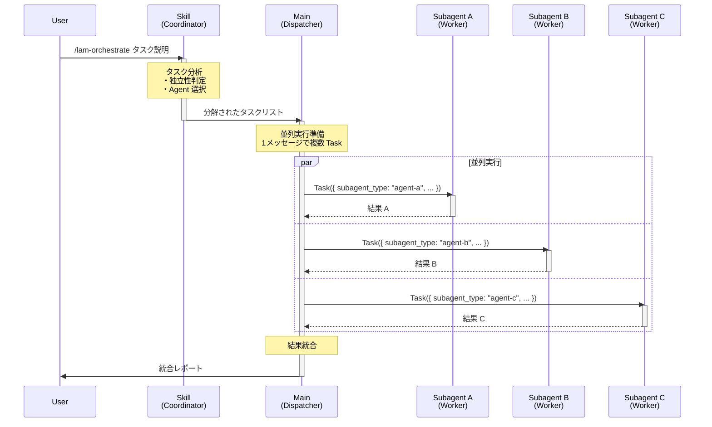
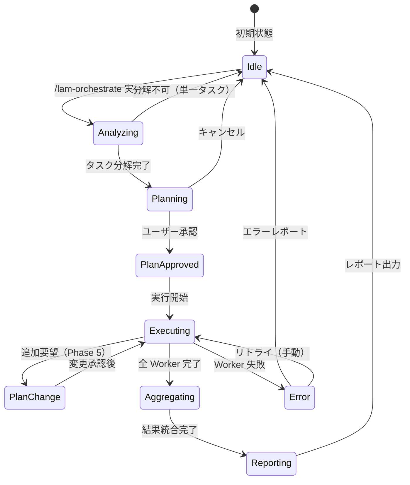
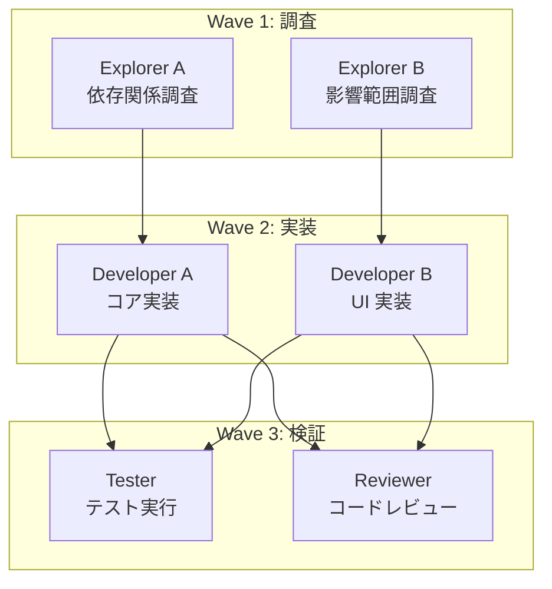
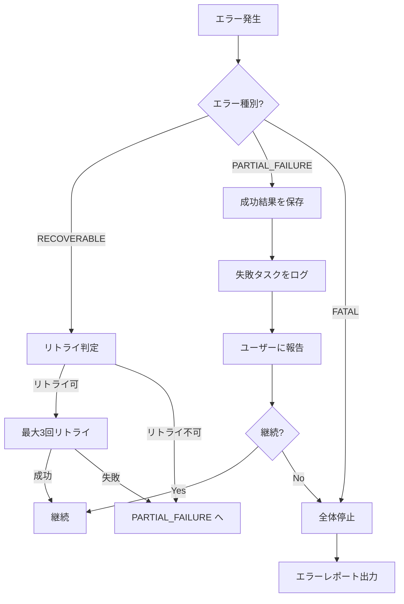
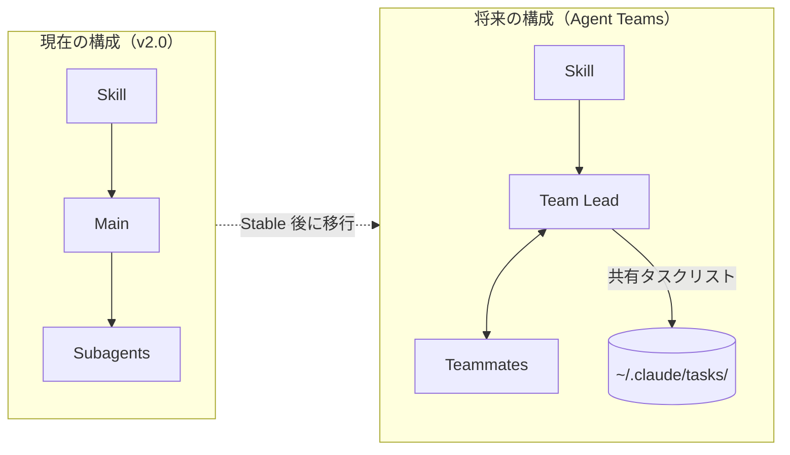

# LAM Orchestrate 設計書

**バージョン**: 3.0.0
**作成日**: 2026-01-29
**改訂日**: 2026-02-15
**ステータス**: Active (Operational Feedback Applied)
**前バージョン**: 2.0.0 (Active)
**参照 Claude Code バージョン**: 2.1.42
**関連文書**: `_reference/2026-01-29.md`

> **改訂履歴**:
> - v1.0.0 (2026-01-29): 初版。Anthropic Swarm 機能リリース待ちで On Hold。
> - v2.0.0 (2026-02-15): Claude Code 公式 Subagent/Skills API に準拠して全面改訂。Agent Teams は将来拡張パスとして記載。
> - v3.0.0 (2026-02-15): 運用フィードバック反映。Phase 構成を 5 段階に拡張、承認フロー・計画変更プロトコル追加、Agent 一覧を実装に合わせて更新。

---

## 1. 概要

### 1.1 目的

Claude Code の Subagent 制約（Subagent が他の Subagent を起動できない）を回避し、
**擬似的な3層構造**による自律的なタスク実行を実現する。

### 1.2 背景

```
┌─────────────────────────────────────────────────────────────────┐
│ 課題: Subagent の階層制限                                       │
│                                                                 │
│   Main ──┬── Subagent A                                        │
│          ├── Subagent B     ← ここまでは可能                   │
│          └── Subagent C                                        │
│                   │                                             │
│                   └── Sub-Subagent ← これは不可能              │
│                                                                 │
│ 解決策: Skill + Main + Subagent の役割分離で擬似3層を実現      │
└─────────────────────────────────────────────────────────────────┘
```

### 1.3 スコープ

| 含む | 含まない |
|------|----------|
| Skill による戦略定義 | 外部オーケストレーター（claude-flow 等） |
| 並列 Subagent 実行 | taskqueue-mcp 統合（将来拡張） |
| Agent 定義テンプレート | Swarm 機能（Anthropic 実装待ち） |
| | Tier 定義の変更（SSOT で管理） |

---

## 2. アーキテクチャ

### 2.1 全体構成図

```
┌─────────────────────────────────────────────────────────────────────────┐
│                        LAM Orchestrate Architecture                      │
├─────────────────────────────────────────────────────────────────────────┤
│                                                                         │
│  ┌─────────────────────────────────────────────────────────────────┐   │
│  │ Layer 1: Coordinator (Strategy)                                  │   │
│  │ ┌─────────────────────────────────────────────────────────────┐ │   │
│  │ │  /lam-orchestrate Skill                                     │ │   │
│  │ │  ・タスク分解ルール                                         │ │   │
│  │ │  ・並列化判断基準                                           │ │   │
│  │ │  ・Agent 選択ロジック                                       │ │   │
│  │ └─────────────────────────────────────────────────────────────┘ │   │
│  └──────────────────────────────┬──────────────────────────────────┘   │
│                                 │                                       │
│                                 ▼                                       │
│  ┌─────────────────────────────────────────────────────────────────┐   │
│  │ Layer 2: Dispatcher (Coordination)                               │   │
│  │ ┌─────────────────────────────────────────────────────────────┐ │   │
│  │ │  Main Claude Process                                        │ │   │
│  │ │  ・Skill の指示を実行                                       │ │   │
│  │ │  ・Task tool で Subagent を起動                             │ │   │
│  │ │  ・結果の集約と報告                                         │ │   │
│  │ └─────────────────────────────────────────────────────────────┘ │   │
│  └──────────────────────────────┬──────────────────────────────────┘   │
│                                 │                                       │
│              ┌──────────────────┼──────────────────┐                   │
│              ▼                  ▼                  ▼                   │
│  ┌─────────────────────────────────────────────────────────────────┐   │
│  │ Layer 3: Workers (Execution)                                     │   │
│  │ ┌───────────────┐ ┌───────────────┐ ┌───────────────┐           │   │
│  │ │  Subagent A   │ │  Subagent B   │ │  Subagent C   │           │   │
│  │ │  (並列実行)   │ │  (並列実行)   │ │  (並列実行)   │           │   │
│  │ └───────────────┘ └───────────────┘ └───────────────┘           │   │
│  └─────────────────────────────────────────────────────────────────┘   │
│                                                                         │
└─────────────────────────────────────────────────────────────────────────┘
```

### 2.2 シーケンス図



### 2.3 状態遷移図



---

## 3. コンポーネント詳細

### 3.1 Skill: `/lam-orchestrate`

#### 3.1.1 ファイル配置

```
.claude/
└── skills/
    └── lam-orchestrate/
        ├── SKILL.md           # メイン指示（必須）
        └── examples/
            └── execution-plan-sample.md  # 出力例
```

> **Note**: Claude Code 2.x 以降、Skills は `SKILL.md` をエントリポイントとするディレクトリ構造。
> `.claude/commands/` との互換性は維持されるが、Skills 形式を推奨。

#### 3.1.2 Skill 定義（公式 SKILL.md 形式準拠）

```yaml
# .claude/skills/lam-orchestrate/SKILL.md
---
name: lam-orchestrate
description: >
  LAM Coordinator - タスクを分解し、適切な Subagent で並列実行する。
  複数ファイル/モジュールにまたがる作業の自動分解・並列実行に使用。
  Use proactively when the user requests multi-file or multi-module operations.
disable-model-invocation: true
allowed-tools: Task, Read, Glob, Grep
argument-hint: "[タスク説明] [--parallel=N] [--dry-run]"
---

# LAM Orchestrate Coordinator

あなたは LAM プロジェクトの **Coordinator**（調整者）です。
ユーザーから与えられたタスクを分析し、最適な実行計画を立案・実行します。

## 実行フロー

### Phase 1: 分析

1. タスクの全体像を把握する
2. 対象ファイル/ディレクトリを `Glob` と `Grep` で調査する
3. **Git 状態の確認**:
   - `git status` でワーキングツリーの状態を把握
   - 対象ファイルに未コミット変更がある場合、`git diff` で差分を確認
   - `.claude/current-phase.md` を読み取り、現在のフェーズを把握
4. 独立して実行可能な単位に分解する
5. 各単位に最適な Subagent を割り当てる

### Phase 2: 実行計画の提示

分解結果を以下の形式で表示し、ユーザーの承認を得る:

```
## 実行計画

| # | タスク | Subagent | Wave |
|---|--------|----------|:----:|
| 1 | [タスク説明] | [subagent-name] | 1 |
| 2 | [タスク説明] | [subagent-name] | 1 |
| 3 | [タスク説明] | [subagent-name] | 2 |

**並列数**: N（Wave 内で並列実行）
**推定 Subagent 数**: M

続行しますか？ [Y/n]
```

**承認の範囲**:
- ユーザーが計画を承認した場合、全 Wave の実行が許可されたものとする
- Wave 完了ごとの再承認は不要（ただし FATAL エラー発生時は停止し報告）
- 途中で計画変更が必要になった場合は「Phase 5: 計画変更プロトコル」に従う

`--dry-run` が指定された場合、計画表示のみで実行しない。

### Phase 3: 実行

1. 並列実行可能なタスクを **1メッセージで複数の Task を呼び出す**
2. 依存関係があるタスクは Wave を分けて逐次実行する
3. 各 Wave の完了を待ってから次の Wave を開始する

### Phase 4: 統合

1. 各 Subagent の結果を収集する
2. 変更ファイル一覧を統合する
3. 整合性チェック（インポートの競合等）を行う
4. 統合レポートを作成する

### Phase 5: 計画変更プロトコル（Phase 3 実行中に発動）

Phase 3（実行）の途中でユーザーから追加要望が発生した場合、以下の手順で対応する:

1. **差分計画の作成**: 既存計画との差分を明示した「変更計画」を作成する
2. **影響範囲の分析**: 既に完了した Wave への影響（ファイル再編集の要否等）を分析する
3. **変更計画の提示**: 以下の形式で提示し、承認を得る

```
## 計画変更提案

**追加要件**: [ユーザーの追加要望]

**影響**:
- Wave X（完了済み）: 再実行不要 / ファイル Z の再編集が必要

**追加タスク**:
| # | タスク | Subagent | Wave |
|---|--------|----------|:----:|
| N | [新規タスク] | [agent] | M |

続行しますか？ [Y/n]
```

4. **承認後実行**: 承認されれば Phase 3 の実行ルールに従って追加タスクを実行する

## 並列実行ルール

```
最大並列数: 5（デフォルト）
引数 --parallel=N で上書き可能

並列化の条件:
  ✓ 異なるファイル/ディレクトリを対象としている
  ✓ 相互に依存しないタスク
  ✗ 同一ファイルへの書き込み → 直列化
  ✗ 出力が次の入力になる → Wave 分離
```

## Subagent 選択ルール

`.claude/agents/` に定義されたカスタム Subagent を優先し、
未定義のパターンにはビルトイン Subagent を使用する。

| ファイルパターン | 推奨 Subagent | 備考 |
|------------------|---------------|------|
| `*test*`, `*spec*` | test-runner | カスタム定義 |
| `*.md`, `docs/` | doc-writer | カスタム定義。仕様策定と清書の両方 |
| コードレビュー系 | code-reviewer | カスタム定義（LAM品質基準） |
| 調査・探索系 | Explore | ビルトイン |
| その他 | general-purpose | ビルトイン |

> プロジェクト固有の Subagent（例: `rust-specialist`, `frontend-dev`）は
> `.claude/agents/` に追加すれば自動的に選択候補に含まれる。

## 禁止事項

- Subagent からの Subagent 起動（Claude Code の技術的制約）
- 未分析でのタスク実行
- ユーザー承認なしでの実行開始（`--no-confirm` 指定時を除く）

## エラー処理

| エラー種別 | 対応 |
|-----------|------|
| RECOVERABLE（タイムアウト等） | 最大3回リトライ |
| PARTIAL_FAILURE（一部失敗） | 成功結果を保持し、失敗タスクを報告 |
| FATAL（前提条件エラー） | 全体停止、エラーレポート出力 |

## 実行結果フォーマット

```
## 実行結果

| タスク | 状態 | 変更 | 詳細 |
|--------|:----:|------|------|
| [タスク1] | ✅ | N files | [概要] |
| [タスク2] | ✅ | N files | [概要] |
| [タスク3] | ❌ | - | [エラー内容] |

**合計**: X ファイル変更、Y エラー
```
```

#### 3.1.3 引数仕様

| 引数 | 説明 | デフォルト |
|------|------|-----------|
| `--parallel=N` | 最大並列数 | 5 |
| `--dry-run` | 実行計画のみ表示 | false |
| `--no-confirm` | 確認スキップ | false |
| `--wave=N` | 特定 Wave のみ実行 | all |

### 3.2 Agent 定義

#### 3.2.1 ディレクトリ構造

```
.claude/
└── agents/
    ├── requirement-analyst.md
    ├── design-architect.md
    ├── task-decomposer.md
    ├── tdd-developer.md
    ├── quality-auditor.md
    ├── doc-writer.md
    ├── test-runner.md
    └── code-reviewer.md
```

#### 3.2.2 Subagent テンプレート（公式仕様準拠）

```yaml
# .claude/agents/{agent-name}.md
---
name: {agent-name}
description: >
  {役割の簡潔な説明}。
  {どのような場面で使用されるかの説明}。
  Use proactively when {自動起動の条件}。
model: sonnet  # haiku | sonnet | opus | inherit
tools: Read, Write, Edit, Bash, Grep, Glob
# disallowedTools: Task  # Subagent は Task を使用不可（制約）
# permissionMode: default  # default | acceptEdits | dontAsk | plan
# maxTurns: 20  # 最大ターン数
# memory: project  # user | project | local（永続メモリ）
# hooks:  # Subagent 固有のライフサイクルフック
#   PreToolUse:
#     - matcher: "Bash"
#       hooks:
#         - type: command
#           command: "./scripts/validate.sh"
# skills:  # プリロードする Skill（Subagent 起動時に注入）
#   - api-conventions
---

# {Agent 名}

あなたは {専門分野} の専門家です。

## 担当範囲
- {担当するファイル/ディレクトリ}
- {担当する作業種別}

## 制約
- {守るべきルール}
- {禁止事項}

## 出力形式
- {期待される出力フォーマット}
```

> **公式仕様との対応**（Claude Code 2.1.42 時点）:
>
> | フィールド | 必須 | 説明 |
> |-----------|:----:|------|
> | `name` | Yes | 一意識別子（小文字+ハイフン） |
> | `description` | Yes | Claude が委任判断に使用する説明文 |
> | `tools` | No | 使用可能ツール（省略時は全ツール継承） |
> | `disallowedTools` | No | 拒否ツールリスト |
> | `model` | No | `sonnet`, `opus`, `haiku`, `inherit`（デフォルト: `inherit`） |
> | `permissionMode` | No | 権限モード |
> | `maxTurns` | No | 最大ターン数 |
> | `memory` | No | 永続メモリスコープ（セッション横断学習） |
> | `hooks` | No | ライフサイクルフック |
> | `skills` | No | プリロード Skill |
> | `mcpServers` | No | 使用可能 MCP サーバー |

#### 3.2.3 標準 Agent 一覧

```
┌─────────────────────┬──────────────────────────────────────────────────┐
│ requirement-analyst  │ 要件分析・ユーザーストーリー                      │
│                     │ フェーズ: PLANNING │ モデル: sonnet              │
├─────────────────────┼──────────────────────────────────────────────────┤
│ design-architect     │ API設計・アーキテクチャ設計                       │
│                     │ フェーズ: PLANNING │ モデル: sonnet              │
├─────────────────────┼──────────────────────────────────────────────────┤
│ task-decomposer      │ タスク分割・依存関係整理                          │
│                     │ フェーズ: PLANNING │ モデル: sonnet              │
├─────────────────────┼──────────────────────────────────────────────────┤
│ tdd-developer        │ Red-Green-Refactor TDD実装                       │
│                     │ フェーズ: BUILDING │ モデル: sonnet              │
├─────────────────────┼──────────────────────────────────────────────────┤
│ quality-auditor      │ 品質監査・セキュリティチェック                    │
│                     │ フェーズ: AUDITING │ モデル: sonnet              │
├─────────────────────┼──────────────────────────────────────────────────┤
│ doc-writer           │ ドキュメント作成・仕様策定・更新                  │
│                     │ フェーズ: ALL │ モデル: sonnet                   │
├─────────────────────┼──────────────────────────────────────────────────┤
│ test-runner          │ テスト実行・分析                                  │
│                     │ フェーズ: BUILDING │ モデル: haiku               │
├─────────────────────┼──────────────────────────────────────────────────┤
│ code-reviewer        │ コードレビュー（LAM品質基準適用）                │
│                     │ フェーズ: AUDITING │ モデル: sonnet              │
└─────────────────────┴──────────────────────────────────────────────────┘
```

> Note: `rust-specialist`, `frontend-dev`, `explorer` はプロジェクト固有の例であり、必要に応じて `.claude/agents/` に追加する。

---

## 4. 実行フロー詳細

### 4.1 基本フロー

```
┌─────────────────────────────────────────────────────────────────────────┐
│ User Input                                                              │
│ > /lam-orchestrate src/ をリファクタリング                              │
└────────────────────────────────────┬────────────────────────────────────┘
                                     │
                                     ▼
┌─────────────────────────────────────────────────────────────────────────┐
│ Phase 1: Analysis (Git/Phase State + Structure)                        │
├─────────────────────────────────────────────────────────────────────────┤
│ 1. Git 状態確認                                                         │
│    ├── git status でワーキングツリー確認                                │
│    └── .claude/current-phase.md で現在のフェーズ把握                   │
│                                                                         │
│ 2. src/ の構造を調査                                                    │
│    └── Glob("src/**/*") で対象ファイル列挙                             │
│                                                                         │
│ 3. 独立性を分析                                                         │
│    ├── src/auth/     → 独立（認証モジュール）                          │
│    ├── src/api/      → 独立（API エンドポイント）                      │
│    └── src/utils/    → 独立（ユーティリティ）                          │
│                                                                         │
│ 4. Agent を割り当て                                                     │
│    └── すべて frontend-dev（TypeScript）                               │
└────────────────────────────────────┬────────────────────────────────────┘
                                     │
                                     ▼
┌─────────────────────────────────────────────────────────────────────────┐
│ Phase 2: Plan Presentation                                              │
├─────────────────────────────────────────────────────────────────────────┤
│ ## 実行計画                                                             │
│                                                                         │
│ | # | タスク | Subagent | Wave |                                        │
│ |---|--------|----------|:----:|                                        │
│ | 1 | src/auth/ リファクタリング | frontend-dev | 1 |                  │
│ | 2 | src/api/ リファクタリング | frontend-dev | 1 |                   │
│ | 3 | src/utils/ リファクタリング | frontend-dev | 1 |                 │
│                                                                         │
│ 続行しますか？ [Y/n]                                                    │
└────────────────────────────────────┬────────────────────────────────────┘
                                     │
                           ユーザー承認（全 Wave の実行許可）
                                     │
                                     ▼
┌─────────────────────────────────────────────────────────────────────────┐
│ Phase 3: Execution (Main → Workers)                                     │
├─────────────────────────────────────────────────────────────────────────┤
│                                                                         │
│  Main Process (1メッセージで3つの Task を発行)                         │
│  ┌──────────────────────────────────────────────────────────────────┐  │
│  │ Task({                                                           │  │
│  │   subagent_type: "frontend-dev",                                 │  │
│  │   prompt: "src/auth/ をリファクタリング..."                      │  │
│  │ })                                                               │  │
│  │                                                                  │  │
│  │ Task({                                                           │  │
│  │   subagent_type: "frontend-dev",                                 │  │
│  │   prompt: "src/api/ をリファクタリング..."                       │  │
│  │ })                                                               │  │
│  │                                                                  │  │
│  │ Task({                                                           │  │
│  │   subagent_type: "frontend-dev",                                 │  │
│  │   prompt: "src/utils/ をリファクタリング..."                     │  │
│  │ })                                                               │  │
│  └──────────────────────────────────────────────────────────────────┘  │
│                              │                                          │
│              ┌───────────────┼───────────────┐                          │
│              ▼               ▼               ▼                          │
│  ┌──────────────┐ ┌──────────────┐ ┌──────────────┐                    │
│  │ Worker A     │ │ Worker B     │ │ Worker C     │                    │
│  │ src/auth/    │ │ src/api/     │ │ src/utils/   │                    │
│  │ 実行中...    │ │ 実行中...    │ │ 実行中...    │   ← 並列実行      │
│  └──────────────┘ └──────────────┘ └──────────────┘                    │
│              │               │               │                          │
│              └───────────────┼───────────────┘                          │
│                              ▼                                          │
│                     結果を Main に返却                                  │
└────────────────────────────────────┬────────────────────────────────────┘
                                     │
                                     ▼
┌─────────────────────────────────────────────────────────────────────────┐
│ Phase 4: Aggregation                                                    │
├─────────────────────────────────────────────────────────────────────────┤
│ 1. 各 Worker の結果を収集                                               │
│ 2. 変更ファイル一覧を統合                                               │
│ 3. 整合性チェック（インポートの競合等）                                │
│ 4. レポート生成                                                         │
└────────────────────────────────────┬────────────────────────────────────┘
                                     │
                                     ▼
┌─────────────────────────────────────────────────────────────────────────┐
│ Output                                                                  │
├─────────────────────────────────────────────────────────────────────────┤
│ ## 実行結果                                                             │
│                                                                         │
│ | タスク | 状態 | 変更ファイル |                                        │
│ |--------|------|--------------|                                        │
│ | src/auth/ | ✅ | 3 files |                                            │
│ | src/api/  | ✅ | 5 files |                                            │
│ | src/utils/| ✅ | 2 files |                                            │
│                                                                         │
│ **合計**: 10 ファイル変更                                               │
└─────────────────────────────────────────────────────────────────────────┘
```

### 4.2 Wave 実行フロー（依存関係あり）



```
Wave 1 (並列) ──完了──→ Wave 2 (並列) ──完了──→ Wave 3 (並列)

┌─────────────────────────────────────────────────────────────────────────┐
│ Wave 実行の制御                                                         │
├─────────────────────────────────────────────────────────────────────────┤
│                                                                         │
│ Main:                                                                   │
│   # Wave 1                                                              │
│   results_1 = [                                                         │
│     Task(explorer, "依存関係調査"),                                     │
│     Task(explorer, "影響範囲調査")                                      │
│   ]  # 並列実行                                                         │
│                                                                         │
│   # Wave 1 完了を待機（自動）                                           │
│                                                                         │
│   # Wave 2（Wave 1 の結果を使用）                                       │
│   results_2 = [                                                         │
│     Task(developer, f"コア実装。参考: {results_1}"),                    │
│     Task(developer, f"UI実装。参考: {results_1}")                       │
│   ]  # 並列実行                                                         │
│                                                                         │
│   # Wave 3                                                              │
│   results_3 = [                                                         │
│     Task(tester, f"テスト。対象: {results_2}"),                         │
│     Task(reviewer, f"レビュー。対象: {results_2}")                      │
│   ]  # 並列実行                                                         │
│                                                                         │
└─────────────────────────────────────────────────────────────────────────┘
```

---

## 5. エラーハンドリング

### 5.1 エラー種別

```
┌─────────────────────────────────────────────────────────────────────────┐
│ Error Classification                                                    │
├─────────────────┬───────────────────────────────────────────────────────┤
│ RECOVERABLE     │ リトライまたは代替処理で継続可能                      │
│                 │ ・Subagent タイムアウト → リトライ                    │
│                 │ ・ファイル競合 → 直列化して再実行                     │
├─────────────────┼───────────────────────────────────────────────────────┤
│ PARTIAL_FAILURE │ 一部タスクのみ失敗、他は成功                          │
│                 │ ・成功結果は保持                                      │
│                 │ ・失敗タスクのみ報告                                  │
├─────────────────┼───────────────────────────────────────────────────────┤
│ FATAL           │ 全体停止が必要                                        │
│                 │ ・前提条件エラー（ファイル不在等）                    │
│                 │ ・Claude Code 自体のエラー                            │
└─────────────────┴───────────────────────────────────────────────────────┘
```

### 5.2 エラー処理フロー



---

## 6. 設定・カスタマイズ

### 6.1 設定ファイル構造

```
.claude/
├── skills/
│   └── lam-orchestrate/
│       └── SKILL.md              # Coordinator Skill
├── agents/
│   ├── requirement-analyst.md    # LAM 標準 Agent
│   ├── doc-writer.md
│   └── ...
└── settings.json                 # グローバル設定（将来）
```

### 6.2 Agent の追加手順

```
1. ファイル作成
   $ touch .claude/agents/my-agent.md

2. テンプレートに従って記述
   ---
   name: my-agent
   description: 新しいエージェント
   model: sonnet
   tools: [Read, Write, ...]
   ---

   # My Agent
   ...

3. 即座に使用可能（再起動不要）
   /lam-orchestrate で自動認識
```

### 6.3 Skill のカスタマイズ

```yaml
# .claude/skills/lam-orchestrate.md の編集

# 並列数変更
最大並列数: 3  # デフォルト 5 → 3

# Agent マッピング追加
| ファイルパターン | 推奨 Agent |
|------------------|------------|
| `*.py` | python-expert |  # 新規追加
```

---

## 7. 制限事項と将来計画

### 7.1 現在の制限

| 制限 | 説明 | 回避策 |
|------|------|--------|
| 2階層のみ | Subagent → Subagent 不可 | Wave パターンで擬似3層 |
| 最大10並列 | Claude Code の制限 | Wave 分割 |
| Background Subagent | MCP ツール使用不可、権限の事前承認必要 | Foreground 実行を基本とする |
| Subagent 間通信なし | 直接通信不可 | Main 経由で中継（Agent Teams で解消予定） |

### 7.2 将来拡張: Agent Teams（Experimental → Stable 後に移行検討）

> **旧称**: Swarm 機能。Opus 4.6 (2026-02) と同時に **Agent Teams** としてリリース。
> 現在は **Experimental**（`CLAUDE_CODE_EXPERIMENTAL_AGENT_TEAMS=1` で有効化）。

```
┌─────────────────────────────────────────────────────────────────────────┐
│ 将来: Agent Teams が Stable になった場合                                 │
├─────────────────────────────────────────────────────────────────────────┤
│                                                                         │
│ 現在 (v3.0 - Subagent ベース):                                         │
│   Skill → Main → Subagents (Task tool)                                 │
│   ・安定 API、低コスト (1.5-2x)                                        │
│   ・Subagent 間通信なし（Main 経由）                                   │
│                                                                         │
│ 将来 (Agent Teams ベース):                                              │
│   Team Lead → Teammates (TeammateTool)                                  │
│   ・Teammate 間直接通信                                                 │
│   ・共有タスクリスト + 自動依存解決                                     │
│   ・高コスト (3-4x、plan mode 時 7x)                                   │
│                                                                         │
│ 移行判断基準:                                                           │
│   ✓ Agent Teams が Experimental を脱した                               │
│   ✓ セッション再開 (/resume) が Teammate に対応                        │
│   ✓ Windows Terminal での split-pane サポート                          │
│   ✓ トークンコストの改善（または許容範囲に）                           │
│                                                                         │
│ マイグレーション:                                                       │
│   - .claude/agents/ の定義はそのまま再利用可能                         │
│   - Skill は Team Lead への指示に変換                                   │
│   - 呼び出し方法は変更なし（/lam-orchestrate 維持）                    │
│                                                                         │
│ 現時点で Agent Teams を採用しない理由:                                  │
│   ✗ セッション再開不可（LAM の save/load と非互換）                    │
│   ✗ タスクステータスのドリフト（信頼性不足）                           │
│   ✗ Lead が委任せず自分で実装を始める問題                              │
│   ✗ トークンコスト 3-7x（個人〜小規模チームには過大）                  │
│   ✗ Windows Terminal で split-pane 非対応                               │
│                                                                         │
└─────────────────────────────────────────────────────────────────────────┘
```

### 7.3 taskqueue-mcp 統合（オプション）



---

## 8. 使用例

### 8.1 基本的な使用

```bash
# 単純なタスク分解・並列実行
/lam-orchestrate src/ をリファクタリング

# 並列数を制限
/lam-orchestrate --parallel=2 全ファイルにドキュメントを追加

# ドライラン（計画のみ）
/lam-orchestrate --dry-run 大規模な変更を計画
```

### 8.2 Tegetege-dice での使用例

```bash
# フロントエンドとバックエンド同時開発
/lam-orchestrate 新しいダイス機能を追加（UI とロジック両方）

# レビューとテスト並列
/lam-orchestrate --parallel=3 PR の品質チェック

# 調査タスク
/lam-orchestrate --dry-run 依存関係を全て洗い出し
```

### 8.3 期待される出力

```markdown
## 実行計画

| # | タスク | Agent | Wave |
|---|--------|-------|:----:|
| 1 | src-tauri/ にダイスロジック追加 | rust-specialist | 1 |
| 2 | src/ に UI コンポーネント追加 | frontend-dev | 1 |
| 3 | 統合テスト | test-runner | 2 |

続行しますか？ [Y/n] y

---

## 実行中...

Wave 1: [========================================] 2/2 完了
Wave 2: [========================================] 1/1 完了

---

## 実行結果

| タスク | 状態 | 変更 | 詳細 |
|--------|:----:|------|------|
| Rust ロジック | ✅ | 3 files | src-tauri/src/dice.rs 等 |
| UI コンポーネント | ✅ | 4 files | src/components/Dice.tsx 等 |
| 統合テスト | ✅ | 1 file | tests/integration.test.ts |

**合計**: 8 ファイル変更、0 エラー
```

---

## 9. チェックリスト

### 9.1 実装チェックリスト

- [x] `.claude/skills/lam-orchestrate/SKILL.md` 作成（公式 SKILL.md 形式）
- [x] `.claude/agents/` に Subagent 定義作成（公式 frontmatter 形式）
  - [x] requirement-analyst.md
  - [x] design-architect.md
  - [x] task-decomposer.md
  - [x] tdd-developer.md
  - [x] quality-auditor.md
  - [x] doc-writer.md
  - [x] test-runner.md
  - [x] code-reviewer.md
- [x] ビルトイン Subagent との重複確認（Explore, Plan, general-purpose）
- [x] 動作確認（ドライラン: `--dry-run`）
- [x] 動作確認（実行）
- [x] ドキュメント更新（CHANGELOG, README）
- [x] 参照 Claude Code バージョンの記録

### 9.2 レビューチェックリスト

- [ ] Skill の指示が明確か（`description` が委任判断に十分か）
- [ ] Subagent の役割がビルトインと重複していないか
- [ ] `tools` フィールドが最小権限原則に従っているか
- [ ] エラーハンドリングが適切か
- [ ] 並列実行の安全性が担保されているか（同一ファイル書き込みの排除）
- [ ] `memory` 設定の適切性（不要な永続化を避ける）

---

## 10. 参考資料

- [_reference/2026-01-29.md](../../_reference/2026-01-29.md) - 調査結果
- [_reference/2026-01-28-02.md](../../_reference/2026-01-28-02.md) - 要求仕様

---

*本設計書は LAM の一部として作成された。*
*v3.0 改訂: 運用フィードバック反映（Phase 5 計画変更プロトコル、承認範囲明確化、Agent 一覧更新）。*
*Agent Teams (旧 Swarm) が Stable になった段階で、Section 7.2 の移行基準に基づき再評価する。*
