# oath-harness Phase 1 (MVP) 設計書

**文書種別**: 詳細設計書 (Design Specification)
**フェーズ**: Phase 1 (MVP)
**作成日**: 2026-02-23
**ステータス**: DRAFT
**参照要件定義書**: `docs/specs/requirements.md`

---

## 目次

1. [アーキテクチャ概要](#1-アーキテクチャ概要)
2. [ディレクトリ構造](#2-ディレクトリ構造)
3. [コンポーネント詳細設計](#3-コンポーネント詳細設計)
   - 3.1 Trust Engine
   - 3.2 hooks 3本
   - 3.3 Risk Category Mapper
   - 3.4 Audit Trail Logger
   - 3.5 Model Router
   - 3.6 Session Trust Bootstrap
   - 3.7 Tool Profile Engine
4. [データフロー図](#4-データフロー図)
5. [JSON スキーマ定義](#5-json-スキーマ定義)
6. [hooks 実装設計](#6-hooks-実装設計)
7. [エラー処理戦略](#7-エラー処理戦略)
8. [テスト戦略](#8-テスト戦略)
9. [インストール設計](#9-インストール設計)
10. [設計判断記録（ADR）](#10-設計判断記録adr)

---

## 1. アーキテクチャ概要

### 1.1 四層アーキテクチャ

oath-harness は以下の四層で構成される。各層の責務は明確に分離されており、下層が上層のインターフェースを実装する。

```
┌──────────────────────────────────────────────────────────────┐
│ Layer 1: Model Router                                        │
│  Opus(Architect) / Sonnet(Analyst) / Haiku(Worker/Reporter)  │
│  AoT条件 + Trust Score → モデル推奨 + エスカレーションチェーン│
│  【Phase 1: 推奨情報の記録のみ。実行時切替はPhase 2で実現】  │
├──────────────────────────────────────────────────────────────┤
│ Layer 2: Trust Engine                                        │
│  信頼スコア蓄積（ドメイン別）→ 自律度計算 → 判定（4段階）   │
│  非対称更新（成功/失敗） + 時間減衰 + 復帰ウォームアップ     │
├──────────────────┬───────────────────────────────────────────┤
│ Layer 3a: Harness│ Layer 3b: Guardrail                      │
│  Session Bootstrap│  Risk Category Mapper                   │
│  Audit Trail     │  Tool Profile Engine                     │
│  State管理       │  フェーズ別ツール制限                    │
├──────────────────┴───────────────────────────────────────────┤
│ Layer 4: Execution Layer                                     │
│  hooks/pre-tool-use.sh                                       │
│  hooks/post-tool-use.sh                                      │
│  hooks/stop.sh                                               │
│  （Claude Code hooks API との境界面）                        │
└──────────────────────────────────────────────────────────────┘
```

### 1.2 コンポーネント依存関係図


### 1.3 Claude Code hooks API との統合ポイント

Claude Code は hooks として bash スクリプトを呼び出す。oath-harness の hooks は以下の契約に従う。

| hook | 呼び出しタイミング | 入力 | 出力 |
|:--|:--|:--|:--|
| `PreToolUse` | ツール実行の直前 | JSON（tool_name, tool_input） | exit 0=許可, exit 1=ブロック, stdout にメッセージ |
| `PostToolUse` | ツール実行の完了後 | JSON（tool_name, tool_input, result） | 無視（副作用のみ） |
| `Stop` | セッション終了時 | なし | 無視（副作用のみ） |

**フォールセーフ原則**: hooks が何らかの理由で失敗した場合、`PreToolUse` は exit 1（ブロック）を返す。フォールオープン（失敗時に許可）は禁止。

---

## 2. ディレクトリ構造

```
oath-harness/
├── CLAUDE.md                       # プロジェクト憲法
├── README.md                       # インストール手順（Phase 1 完了後に作成）
│
├── hooks/                          # Claude Code hooks エントリポイント
│   ├── pre-tool-use.sh             # PreToolUse フック（薄いラッパー）
│   ├── post-tool-use.sh            # PostToolUse フック（薄いラッパー）
│   └── stop.sh                     # Stop フック（薄いラッパー）
│
├── lib/                            # 共通ロジックライブラリ（全ロジックの SSOT）
│   ├── common.sh                   # 共通ユーティリティ（パス定数、ログ出力）
│   ├── config.sh                   # 設定ファイル読み込み・バリデーション
│   ├── bootstrap.sh                # Session Trust Bootstrap
│   ├── trust-engine.sh             # Trust Engine コア
│   ├── risk-mapper.sh              # Risk Category Mapper
│   ├── tool-profile.sh             # Tool Profile Engine
│   ├── audit.sh                    # Audit Trail Logger
│   ├── model-router.sh             # Model Router（推奨情報生成）
│   └── jq/                         # 複雑な jq フィルタ（3行超のもの）
│       ├── trust-update.jq         # 信頼スコア更新フィルタ
│       └── audit-entry.jq          # 監査エントリ生成フィルタ
│
├── config/                         # 設定ファイル
│   └── settings.json               # 動作パラメータ（バリデーション済み）
│
├── state/                          # 永続化ファイル
│   └── trust-scores.json           # 信頼スコア SSOT（セッション間永続化）
│
├── audit/                          # 監査ログ（JSONL、日付別）
│   └── YYYY-MM-DD.jsonl            # 日次監査ログ
│
├── install/                        # インストールスクリプト
│   └── install.sh                  # Claude Code settings.json への hooks 登録
│
├── tests/                          # テストスイート
│   ├── unit/                       # 単体テスト（bats）
│   │   ├── trust-engine.bats       # Trust Engine のスコア計算テスト
│   │   ├── risk-mapper.bats        # Risk Category Mapper テスト
│   │   ├── tool-profile.bats       # Tool Profile Engine テスト
│   │   └── config.bats             # 設定バリデーションテスト
│   ├── integration/                # 統合テスト（bats）
│   │   ├── hooks-flow.bats         # hooks の通し動作テスト
│   │   ├── audit-trail.bats        # Audit Trail の記録テスト
│   │   └── session-bootstrap.bats  # Session Bootstrap テスト
│   ├── e2e/                        # E2E テスト（将来）
│   ├── fixtures/                   # テスト用フィクスチャ
│   │   ├── trust-scores-v1.json    # v1 形式フィクスチャ（マイグレーションテスト用）
│   │   ├── trust-scores-v2.json    # v2 形式フィクスチャ
│   │   └── settings-invalid.json   # バリデーション違反設定（エラーケース用）
│   └── bats-core/                  # bats-core（開発時依存、git submodule）
│
└── docs/
    ├── specs/
    │   ├── requirements.md         # 要件定義書（SSOT）
    │   └── design.md               # 本設計書
    ├── adr/                        # Architecture Decision Records
    │   ├── 0001-bash-module-split.md
    │   ├── 0002-jq-filter-management.md
    │   ├── 0003-flock-strategy.md
    │   ├── 0004-bats-core-adoption.md
    │   ├── 0005-model-router-impl.md
    │   └── 0006-complexity-fixed-value.md
    └── refs/                       # 参照ドキュメント（変更不可）
```

---

## 3. コンポーネント詳細設計

### 3.1 Trust Engine

**対応要件**: FR-TE-001〜FR-TE-009
**対応 AC**: AC-001〜AC-010

#### 責務と境界

信頼スコアの計算・更新・永続化と、4段階判定ロジックの実行。外部インターフェース（hooks、Risk Category Mapper）から隔離された純粋な計算コアである。ファイル I/O はこのコンポーネントのみが `trust-scores.json` に対して行う（flock 経由）。

#### 公開インターフェース（bash 関数シグネチャ）

```bash
# ドメインの信頼スコアを取得する
# 引数: domain (string)
# 出力: score (float, stdout)
# エラー: ドメインが存在しない場合は _global の値を返す
te_get_score() { local domain="$1"; ... }

# 自律度スコアを計算する
# 引数: trust (float), risk_value (1-4), complexity (float, デフォルト 0.5)
# 出力: autonomy (float, stdout)
# 公式: autonomy = 1 - (λ1 × risk_norm + λ2 × complexity) × (1 - trust)
#        risk_norm = risk_value / 4.0
te_calc_autonomy() { local trust="$1" risk_value="$2" complexity="${3:-0.5}"; ... }

# 4段階判定を返す
# 引数: autonomy (float), risk_category (string: low|medium|high|critical)
# 出力: decision (string: auto_approved|logged_only|human_required|blocked, stdout)
te_decide() { local autonomy="$1" risk_category="$2"; ... }

# 成功時のスコア更新を実行する（副作用: trust-scores.json を更新）
# 引数: domain (string)
# 戻り値: 0=成功, 1=失敗（flock タイムアウト等）
te_record_success() { local domain="$1"; ... }

# 失敗時のスコア更新を実行する（副作用: trust-scores.json を更新）
# 引数: domain (string)
# 戻り値: 0=成功, 1=失敗
te_record_failure() { local domain="$1"; ... }

# セッション開始時の時間減衰を計算してスコアを更新する
# 引数: なし（全ドメインに適用）
# 副作用: trust-scores.json を更新
te_apply_time_decay() { ... }
```

#### 内部ロジック（擬似コード）

```
function te_calc_autonomy(trust, risk_value, complexity=0.5):
  lambda1 = config.risk.lambda1  # デフォルト 0.6
  lambda2 = config.risk.lambda2  # デフォルト 0.4
  risk_norm = risk_value / 4.0   # 1-4 を 0.25-1.0 に正規化
  autonomy = 1 - (lambda1 × risk_norm + lambda2 × complexity) × (1 - trust)
  return clamp(autonomy, 0.0, 1.0)

function te_decide(autonomy, risk_category):
  if risk_category == "critical":
    return "blocked"
  if autonomy > 0.8:
    return "auto_approved"
  if autonomy >= 0.4:
    return "logged_only"
  return "human_required"

function te_record_success(domain):
  acquire_flock(TRUST_SCORES_JSON, timeout=5)
  data = read_json(TRUST_SCORES_JSON)
  score = data.domains[domain].score
  total_ops = data.domains[domain].total_operations
  is_warming_up = data.domains[domain].is_warming_up
  warmup_remaining = data.domains[domain].warmup_remaining

  # 加算係数の決定
  if total_ops <= config.trust.boost_threshold:  # ≤ 20
    rate = is_warming_up ? 0.10 : 0.05
  else:
    rate = is_warming_up ? 0.04 : 0.02

  new_score = score + (1 - score) × rate
  new_score = clamp(new_score, 0.0, 1.0)

  # ウォームアップカウンタ更新
  if is_warming_up:
    warmup_remaining -= 1
    if warmup_remaining <= 0:
      is_warming_up = false
      warmup_remaining = 0

  update_domain(domain, {
    score: new_score,
    successes: +1,
    total_operations: +1,
    last_operated_at: now(),
    is_warming_up: is_warming_up,
    warmup_remaining: warmup_remaining
  })
  write_json(TRUST_SCORES_JSON, data)
  release_flock()

function te_apply_time_decay():
  acquire_flock(TRUST_SCORES_JSON, timeout=5)
  data = read_json(TRUST_SCORES_JSON)
  now = current_datetime()

  for each domain in data.domains:
    last_op = data.domains[domain].last_operated_at
    days_elapsed = (now - last_op).days

    if days_elapsed > config.trust.hibernation_days:  # > 14
      decay_days = days_elapsed - config.trust.hibernation_days
      data.domains[domain].score *= 0.999 ^ decay_days

      # 復帰ウォームアップの開始
      data.domains[domain].is_warming_up = true
      data.domains[domain].warmup_remaining = config.trust.warmup_operations  # 5

  write_json(TRUST_SCORES_JSON, data)
  release_flock()
```

#### 依存コンポーネント

- `lib/common.sh` — パス定数、flock ユーティリティ
- `lib/config.sh` — λ1, λ2, 閾値等のパラメータ読み込み
- `lib/jq/trust-update.jq` — スコア更新の jq フィルタ

#### エラー処理方針

| エラー条件 | 処理 |
|:--|:--|
| trust-scores.json 読み込み失敗 | `_global` ドメインの初期値 (0.3) で継続 |
| flock タイムアウト (5秒) | te_record_success/failure は skip（記録しない）。判定には元のスコアを使う |
| score が範囲外 (< 0.0 or > 1.0) | `clamp` して 0.0 〜 1.0 に収める |
| 設定値が不正 | `lib/config.sh` のデフォルト値にフォールバック |

---

### 3.2 hooks 3本（PreToolUse / PostToolUse / Stop）

**対応要件**: FR-HK-001〜FR-HK-005
**対応 AC**: AC-011〜AC-014

#### 責務と境界

Claude Code の hooks API とのインターフェース。hooks は 30行以内の薄いエントリポイントであり、実際のロジックは `lib/` に委譲する。hooks の責務は「入力の受け取り」と「lib/ への委譲」と「exit コードの設定」のみ。

#### 3.2.1 PreToolUse フック

```bash
# hooks/pre-tool-use.sh
#!/bin/bash
set -euo pipefail

SCRIPT_DIR="$(cd "$(dirname "${BASH_SOURCE[0]}")" && pwd)"
HARNESS_ROOT="$(cd "${SCRIPT_DIR}/.." && pwd)"

# エラー時は安全側（ブロック）に倒す（FR-HK-004）
trap 'echo "oath-harness: internal error - blocking for safety" >&2; exit 1' ERR

source "${HARNESS_ROOT}/lib/common.sh"
source "${HARNESS_ROOT}/lib/config.sh"
source "${HARNESS_ROOT}/lib/risk-mapper.sh"
source "${HARNESS_ROOT}/lib/tool-profile.sh"
source "${HARNESS_ROOT}/lib/trust-engine.sh"
source "${HARNESS_ROOT}/lib/audit.sh"
source "${HARNESS_ROOT}/lib/model-router.sh"

# Claude Code から stdin で JSON を受け取る
INPUT="$(cat)"
TOOL_NAME="$(echo "${INPUT}" | jq -r '.tool_name')"
TOOL_INPUT="$(echo "${INPUT}" | jq -c '.tool_input')"

# メインフロー（lib/ に委譲）
main_pre_tool_use "${TOOL_NAME}" "${TOOL_INPUT}"
```

**public 関数シグネチャ（lib/内の実装）**:

```bash
# PreToolUse のメインフロー
# 引数: tool_name (string), tool_input (JSON string)
# 副作用: stdout にメッセージ出力（blocked/human_required 時）
# 戻り値: 0=許可（auto_approved/logged_only）, 1=ブロック（blocked）
#          human_required の場合は Claude Code の確認UI を発動させる仕組みで返す
main_pre_tool_use() { local tool_name="$1" tool_input="$2"; ... }
```

**内部フロー**:

```
main_pre_tool_use(tool_name, tool_input):
  1. domain = rcm_get_domain(tool_name, tool_input)
  2. risk_category, risk_value = rcm_classify(tool_name, tool_input)
  3. trust = te_get_score(domain)
  4. autonomy = te_calc_autonomy(trust, risk_value, COMPLEXITY_FIXED=0.5)
  5. profile_decision = tpe_check(tool_name, domain, current_phase)
     if profile_decision == "blocked":
       decision = "blocked"
       reason = "Tool denied by phase profile: " + current_phase
     else:
       decision = te_decide(autonomy, risk_category)
  6. atl_append_pre(session_id, tool_name, tool_input, domain, risk_category,
                    trust, autonomy, decision)
  7. mr_recommend(autonomy, risk_category, trust, decision)  # 記録のみ
  8. case decision:
       "auto_approved" -> exit 0
       "logged_only"   -> exit 0  # 許可するが記録済み
       "human_required"-> echo "oath-harness requires human approval: ..." >&2
                          exit 2  # Claude Code の確認UIを発動
       "blocked"       -> echo "oath-harness: BLOCKED - ${reason}" >&2
                          exit 1
```

#### 3.2.2 PostToolUse フック

```bash
# hooks/post-tool-use.sh
#!/bin/bash
set -euo pipefail
# ...（共通ヘッダ）...

INPUT="$(cat)"
TOOL_NAME="$(echo "${INPUT}" | jq -r '.tool_name')"
TOOL_INPUT="$(echo "${INPUT}" | jq -c '.tool_input')"
RESULT_SUCCESS="$(echo "${INPUT}" | jq -r '.result.is_error // false')"

main_post_tool_use "${TOOL_NAME}" "${TOOL_INPUT}" "${RESULT_SUCCESS}"
```

**内部フロー**:

```
main_post_tool_use(tool_name, tool_input, is_error):
  domain = rcm_get_domain(tool_name, tool_input)
  outcome = is_error == "true" ? "failure" : "success"

  if outcome == "success":
    te_record_success(domain)
  else:
    te_record_failure(domain)

  trust_after = te_get_score(domain)
  atl_update_outcome(session_id, tool_name, outcome, trust_after)
  exit 0  # PostToolUse は常に exit 0（副作用のみ）
```

#### 3.2.3 Stop フック

```bash
# hooks/stop.sh
#!/bin/bash
set -euo pipefail
# ...（共通ヘッダ）...

main_stop
```

**内部フロー**:

```
main_stop():
  te_flush()          # trust-scores.json への最終書き込み（flock）
  atl_flush()         # 監査ログの最終フラッシュ
  session_finalize()  # セッション状態の最終記録
  exit 0
```

#### エラー処理方針

| エラー条件 | 処理 |
|:--|:--|
| `set -euo pipefail` によるエラー | trap で捕捉し exit 1（ブロック）を返す |
| JSON parse 失敗 | jq が exit 非ゼロ → trap → exit 1 |
| lib/ ファイルが存在しない | source 失敗 → trap → exit 1 |
| PostToolUse/Stop のエラー | 副作用なしで exit 0（PostToolUse/Stop はブロックしない） |

---

### 3.3 Risk Category Mapper

**対応要件**: FR-RM-001〜FR-RM-007
**対応 AC**: AC-015〜AC-019

#### 責務と境界

ツール名と引数の組み合わせからリスクカテゴリ（low/medium/high/critical）とドメインを決定する。

#### 公開インターフェース

```bash
# ツールのドメインを特定する
# 引数: tool_name (string), tool_input (JSON string)
# 出力: domain (string, stdout)
rcm_get_domain() { local tool_name="$1" tool_input="$2"; ... }

# リスクカテゴリを分類する
# 引数: tool_name (string), tool_input (JSON string)
# 出力: "low 1" | "medium 2" | "high 3" | "critical 4"  (stdout, スペース区切り)
rcm_classify() { local tool_name="$1" tool_input="$2"; ... }

```

#### リスク分類ルール

分類は以下の優先順位で判定する（上位が優先）。

```
優先度 1: critical パターン（常にブロック）
  - curl/wget + 外部 URL（http:// または https://）
  - 環境変数に API_KEY, SECRET, TOKEN, PASSWORD を含むコマンド
  - URL に "trade", "order", "buy", "sell", "payment", "transaction" を含む
  - メール送信コマンド（mail, sendmail, smtp 等）

優先度 2: Deny List（risk = high）
  - rm, rm -rf, rm -r
  - chmod, chown
  - apt, apt-get, brew, pip install（システム変更）
  - git push, git force, git merge（リモート影響）
  - ssh, scp（リモート接続）
  - systemctl, reboot, shutdown
  - mv（移動先が oath-harness/ 内のファイル）

優先度 3: Allow List（risk = low）
  - ls, cat, grep, find, pwd, du, file, head, tail, wc
  - git status, git log, git diff, git show, git branch（読み取り）
  - pytest, npm test, go test（テスト実行）
  - echo, printf（出力のみ）
  - jq（JSON 解析）

優先度 4: Gray Area（risk = medium）
  - 上記のいずれにも合致しない全てのコマンド
```

#### ドメインマッピング

```
tool_name → domain:

  Bash("ls|cat|grep|find|head|tail") → "file_read"
  Read("path")                        → "file_read"
  Write("path") where path contains "docs/" → "docs_write"
  Write("path")                       → "file_write"
  Edit("path") where path contains "docs/" → "docs_write"
  Edit("path")                        → "file_write"
  Bash("pytest|npm test|go test")     → "test_run"
  Bash("git add|git commit")          → "git_local"
  Bash("git push|git pull|git fetch") → "git_remote"
  Bash(その他シェルコマンド)          → "shell_exec"
  その他のツール                      → "_global"
```

#### エラー処理方針

| エラー条件 | 処理 |
|:--|:--|
| tool_name が空 | domain="_global", risk="medium" として継続 |
| tool_input の JSON parse 失敗 | 引数なしとして Allow List のみで分類 |

---

### 3.4 Audit Trail Logger

**対応要件**: FR-AT-001〜FR-AT-005
**対応 AC**: AC-020〜AC-023

#### 責務と境界

全てのツール呼び出しと判定結果を JSONL 形式で記録する。センシティブ値のマスクもこのコンポーネントが担当する。ファイルへの書き込みは追記（append）のみ。過去ログの変更・削除は行わない。

#### 公開インターフェース

```bash
# PreToolUse 時の初期エントリを追記する
# 引数: session_id, tool_name, tool_input(JSON), domain, risk_category,
#        trust_score_before, autonomy_score, decision
# 副作用: audit/YYYY-MM-DD.jsonl に 1行追記
atl_append_pre() { ... }

# PostToolUse 時に outcome と trust_score_after を更新する
# 引数: session_id, tool_name, outcome(success|failure), trust_score_after
# 注意: 既存エントリの更新ではなく、新規行（outcome エントリ）として追記する
atl_update_outcome() { ... }

# セッション終了時のフラッシュ
# 引数: なし
atl_flush() { ... }

# センシティブ値をマスクする（内部関数）
# 引数: tool_input (JSON string)
# 出力: マスク済み JSON (stdout)
# マスク対象: API_KEY, SECRET, TOKEN, PASSWORD, PRIVATE_KEY, ACCESS_KEY を含む
#              キー名または値パターンを検出してマスク
_atl_mask_sensitive() { local tool_input="$1"; ... }
```

#### ログエントリ形式

```jsonl
{"timestamp":"2026-02-23T10:00:00Z","session_id":"uuid","tool_name":"Bash","tool_input":{"command":"ls -la"},"domain":"file_read","risk_category":"low","trust_score_before":0.45,"autonomy_score":0.82,"decision":"auto_approved","outcome":"pending","trust_score_after":null}
{"timestamp":"2026-02-23T10:00:01Z","session_id":"uuid","tool_name":"Bash","tool_input":{"command":"ls -la"},"domain":"file_read","risk_category":"low","trust_score_before":0.45,"autonomy_score":0.82,"decision":"auto_approved","outcome":"success","trust_score_after":0.457}
```

**設計判断**: PreToolUse と PostToolUse は別のエントリとして追記する。`outcome="pending"` でPreToolUse 時のエントリを記録し、PostToolUse 時に `outcome` を確定した新規エントリとして追記する。これにより、ファイルの随時参照と整合性が確保される（上書きなし）。

#### 原子的追記の実現

bash の `echo "..." >> file` はカーネルレベルで O_APPEND フラグを使い、小さなデータでは原子的に動作する（POSIX 保証）。ただし、複数フィールドの結合が必要な場合は一時変数で完全な行を組み立ててから `>>` する。

```bash
atl_append_pre():
  log_line = build_json_line(...)        # 完全な JSON 行を構築
  masked_line = _atl_mask_sensitive(log_line)
  echo "${masked_line}" >> "${AUDIT_FILE}"  # O_APPEND で原子的追記
```

#### エラー処理方針

| エラー条件 | 処理 |
|:--|:--|
| audit ディレクトリが存在しない | mkdir -p で作成してから追記 |
| ファイル書き込み失敗 | stderr に警告。判定処理は継続（記録失敗は処理を止めない） |
| JSON 構築失敗 | 最小限のフォールバック行（timestamp + session_id + error）を記録 |

---

### 3.5 Model Router

**対応要件**: FR-MR-001〜FR-MR-005
**対応 AC**: なし（Phase 1 では「推奨情報の記録のみ」）

#### 責務と境界（Phase 1 の制約）

**重要な設計制約**: Claude Code の hooks API（PreToolUse/PostToolUse/Stop）はツール実行の許可/拒否を制御するものであり、モデル選択を直接制御する機能ではない。Phase 1 では「どのモデルを使うべきか」の推奨情報を Audit Trail に記録するのみとし、実際のモデル切替は Phase 2 の `before_model_resolve` フックで実現する。

Model Router の Phase 1 での役割は「観測と記録」であり、ルーティング情報はシステムプロンプト（CLAUDE.md）の条件式として静的に定義される。

#### 公開インターフェース

```bash
# モデル推奨情報を計算して返す（Audit Trail への記録用）
# 引数: autonomy (float), risk_category (string), trust (float), decision (string)
# 出力: recommended_model (string: "opus"|"sonnet"|"haiku", stdout)
mr_recommend() { local autonomy="$1" risk_category="$2" trust="$3" decision="$4"; ... }

# エスカレーションチェーンの現在位置を返す
# 引数: なし（セッション状態から判断）
# 出力: persona (string: "reporter"|"worker"|"analyst"|"architect", stdout)
mr_current_persona() { ... }
```

#### モデル選択ロジック

```
mr_recommend(autonomy, risk_category, trust, decision):
  # Architect（Opus）を使うべき条件
  if decision == "blocked" and risk_category == "critical":
    return "opus"    # 最重要判断は Architect
  if trust < 0.4:
    return "opus"    # 低信頼ドメインは Architect が監督

  # AoT 条件（settings の opus_aot_threshold = 2）
  # Phase 1 では AoT 判断ポイント数を autonomy から推定する
  # autonomy < 0.6 かつ risk >= medium = 複雑な判断が必要
  if autonomy < 0.6 and risk_category in ["medium", "high"]:
    return "opus"

  # Haiku を使うべき条件
  if decision == "auto_approved" and risk_category == "low":
    return "haiku"   # 単純な低リスク操作は Reporter/Worker

  # デフォルト: Sonnet（Analyst）
  return "sonnet"
```

#### エスカレーションチェーン

```
Reporter(Haiku) → Worker(Haiku) → Analyst(Sonnet) → Architect(Opus) → ユーザー

Phase 1 での実装:
  - セッション状態（state/trust-scores.json の "current_persona" フィールド）に記録
  - hooks の decision 結果で上位エスカレーションをシミュレート
  - 実際の委譲は CLAUDE.md のシステムプロンプト指示として定義
```

#### エラー処理方針

Model Router は推奨情報の記録のみで、処理に影響を与えない。エラーが発生した場合は "sonnet"（デフォルト）を返して継続する。

---

### 3.6 Session Trust Bootstrap

**対応要件**: FR-SB-001〜FR-SB-006
**対応 AC**: AC-028〜AC-030

#### 責務と境界

セッション開始時（PreToolUse の初回呼び出し時）に信頼スコアを読み込み、時間減衰と復帰ウォームアップを適用する。セッション ID の生成も担当する。

**注意**: Claude Code の hooks API には「セッション開始」フックが存在しない。Session Trust Bootstrap は PreToolUse の最初の呼び出し時に「未初期化チェック」を行い、初回のみ実行する設計とする。

#### 公開インターフェース

```bash
# セッションが既に初期化されているかチェックし、未初期化なら Bootstrap を実行する
# 引数: なし
# 副作用: state/trust-scores.json の読み込み・時間減衰適用
# 戻り値: 0=成功, 1=失敗
sb_ensure_initialized() { ... }

# 現在のセッション ID を返す（なければ生成する）
# 出力: session_id (UUID string, stdout)
sb_get_session_id() { ... }

# v1 形式の trust-scores.json を v2 形式に変換する（内部関数）
# 引数: なし（TRUST_SCORES_FILE から直接読み込み、同ファイルに上書き）
# 副作用: TRUST_SCORES_FILE を v2 形式で上書き
_sb_migrate_v1_to_v2() { ... }
```

#### 初期化フロー

```
sb_ensure_initialized():
  # セッション初期化済みチェック（環境変数で管理）
  if OATH_HARNESS_INITIALIZED == "1":
    return 0

  session_id = uuidgen or generate_uuid_from_date()
  export OATH_HARNESS_SESSION_ID="${session_id}"
  export OATH_HARNESS_INITIALIZED="1"

  # trust-scores.json の読み込み
  if not exists(TRUST_SCORES_JSON):
    # 初回起動: デフォルト状態で初期化（FR-SB-005）
    initialize_default_trust_scores()
    return 0

  raw_json = read_file(TRUST_SCORES_JSON)
  version = parse_version(raw_json)

  if version == "1" or version is null:
    # v1 → v2 自動マイグレーション（FR-SB-006）
    _sb_migrate_v1_to_v2()  # TRUST_SCORES_FILE を直接読み書き

  # 時間減衰の適用（FR-SB-003）
  te_apply_time_decay()

  return 0

initialize_default_trust_scores():
  default_json = {
    "version": "2",
    "updated_at": now(),
    "global_operation_count": 0,
    "domains": {
      "_global": {
        "score": config.trust.initial_score,  # 0.3
        "successes": 0,
        "failures": 0,
        "total_operations": 0,
        "last_operated_at": now(),
        "is_warming_up": false,
        "warmup_remaining": 0
      }
    }
  }
  write_json(TRUST_SCORES_JSON, default_json)

_sb_migrate_v1_to_v2():
  # TRUST_SCORES_FILE から直接読み込み
  # v1 は単一の score/successes/failures フィールドを持つ
  # v2 は domains オブジェクトに分割
  # v1 の値を _global ドメインの初期値として使用
  v1_score = read_from_file(TRUST_SCORES_FILE, ".score")
  v1_successes = read_from_file(TRUST_SCORES_FILE, ".successes")
  v1_failures = read_from_file(TRUST_SCORES_FILE, ".failures")
  v2_json = build_v2_with_global(v1_score, v1_successes, v1_failures)
  write_file(TRUST_SCORES_FILE, v2_json)
```

#### エラー処理方針

| エラー条件 | 処理 |
|:--|:--|
| trust-scores.json の JSON 破損 | デフォルト状態（initial_score=0.3）でリセット。stderr に警告 |
| uuidgen が存在しない | `date +%s%N | sha256sum | head -c 32` で代替 UUID を生成 |
| 初期化が重複した場合 | OATH_HARNESS_INITIALIZED フラグで冪等性を保証 |

---

### 3.7 Tool Profile Engine

**対応要件**: FR-TP-001〜FR-TP-005
**対応 AC**: AC-024〜AC-027

#### 責務と境界

現在の Phase（planning/building/auditing）に連動して、ツールグループへのアクセスを制御する。プロンプトベースの制約（Safety-by-Prompt）では防げない意図しない操作を構造的に防止する。

#### 公開インターフェース

```bash
# ツールのアクセス可否をチェックする
# 引数: tool_name (string), domain (string), phase (string)
# 出力: "allowed" | "blocked" | "trust_gated" (stdout)
#        "trust_gated" の場合は trust score と閾値を別途確認する
tpe_check() { local tool_name="$1" domain="$2" phase="$3"; ... }

# 現在の Phase を取得する
# 出力: phase (string: "planning"|"building"|"auditing", stdout)
#        不明な場合は "auditing"（最も制限が強い）を返す（FR-TP-005）
tpe_get_current_phase() { ... }

# Phase を更新する（/planning, /building, /auditing スラッシュコマンド対応）
# 引数: phase (string)
# 副作用: .claude/current-phase.md を更新
tpe_set_phase() { local phase="$1"; ... }
```

#### フェーズ別プロファイル定義（静的定義）

```bash
# lib/tool-profile.sh に静的定義として埋め込む

declare -A PROFILE_PLANNING_ALLOWED=(
  ["file_read"]=1 ["git_read"]=1 ["docs_write"]=1
)
declare -A PROFILE_PLANNING_DENIED=(
  ["file_write"]=1 ["file_write_src"]=1 ["shell_exec"]=1 ["git_remote"]=1
)

declare -A PROFILE_BUILDING_ALLOWED=(
  ["file_read"]=1 ["file_write"]=1 ["git_read"]=1
  ["git_local"]=1 ["shell_exec"]=1 ["test_run"]=1
)
declare -A PROFILE_BUILDING_DENIED=(
  ["git_remote"]=1
)
declare -A PROFILE_BUILDING_TRUST_GATED=(
  ["shell_exec"]=1 ["git_local"]=1
)

declare -A PROFILE_AUDITING_ALLOWED=(
  ["file_read"]=1 ["git_read"]=1
)
declare -A PROFILE_AUDITING_DENIED=(
  ["file_write"]=1 ["shell_exec"]=1 ["git_local"]=1 ["git_remote"]=1
)
```

#### tpe_check の判定フロー

```
tpe_check(tool_name, domain, phase):
  profile = get_profile(phase)  # 不明なphaseは"auditing"を使用

  # 1. denied_groups のチェック（最優先）
  if domain in profile.denied:
    return "blocked"

  # 2. trust_gated のチェック
  if domain in profile.trust_gated:
    return "trust_gated"  # 呼び出し元が Trust Engine で追加判定

  # 3. allowed_groups のチェック
  if domain in profile.allowed:
    return "allowed"

  # 4. 未定義のドメイン = Phase に応じた安全側の判断
  if phase == "auditing":
    return "blocked"
  else:
    return "allowed"  # building/planning では未定義 = 通過させて Trust Engine に委ねる
```

#### Phase 検出の仕組み

Phase は `.claude/current-phase.md` ファイルから読み取る（Claude Code の `/planning` `/building` `/auditing` スラッシュコマンドが更新する）。ファイル拡張子は `.md` だが、内容はフェーズ名のプレーンテキスト1行（例: `BUILDING`）である。

```bash
tpe_get_current_phase():
  phase_file = "${PROJECT_ROOT}/.claude/current-phase.md"
  if not exists(phase_file):
    return "auditing"  # 不明時は最も制限が強いフェーズ

  phase = trim(read_file(phase_file))
  if phase in ["planning", "building", "auditing"]:
    return phase
  else:
    return "auditing"  # 不正な値も安全側に
```

#### エラー処理方針

| エラー条件 | 処理 |
|:--|:--|
| current-phase.md が存在しない | "auditing"（最制限）を使用 |
| 不正な Phase 値 | "auditing" にフォールバック |
| 設定ファイルのプロファイル定義がない | 静的定義（lib/ ハードコード）を使用 |

---

## 4. データフロー図

### 4.1 PreToolUse の完全フロー


### 4.2 PostToolUse のフロー


### 4.3 信頼スコア状態遷移

```mermaid
stateDiagram-v2
    [*] --> Initial: セッション開始\n(trust-scores.json なし)
    [*] --> Hibernating: セッション開始\n(14日超過)
    [*] --> Active: セッション開始\n(14日以内)

    Initial --> WarmingUp: 初回セッション\n(warmup_remaining=5)
    Hibernating --> WarmingUp: 時間減衰適用後\n(is_warming_up=true)

    WarmingUp --> Active: 5操作完了\n(warmup_remaining=0)

    Active --> Active: 操作成功\n(score += rate×(1-score))
    Active --> Active: 操作失敗\n(score ×= 0.85)
    WarmingUp --> WarmingUp: 操作成功\n(rate×2倍速)

    Active --> Hibernating: セッション終了後\n14日経過
    WarmingUp --> Hibernating: セッション終了後\n14日経過
```



---

## 5. JSON スキーマ定義

### 5.1 trust-scores.json スキーマ（v2）

```json
{
  "$schema": "https://json-schema.org/draft/2020-12/schema",
  "title": "TrustScores",
  "description": "oath-harness 信頼スコア永続化ファイル（v2）",
  "type": "object",
  "required": ["version", "updated_at", "global_operation_count", "domains"],
  "properties": {
    "version": {
      "type": "string",
      "enum": ["2"],
      "description": "スキーマバージョン。v1 は自動マイグレーション対象"
    },
    "updated_at": {
      "type": "string",
      "format": "date-time",
      "description": "最終更新日時（ISO 8601）"
    },
    "global_operation_count": {
      "type": "integer",
      "minimum": 0,
      "description": "全セッション通算の操作回数"
    },
    "session_id": {
      "type": "string",
      "description": "最後に使用したセッション ID"
    },
    "current_persona": {
      "type": "string",
      "enum": ["reporter", "worker", "analyst", "architect"],
      "description": "Model Router の現在のペルソナ（記録用）"
    },
    "domains": {
      "type": "object",
      "description": "ドメイン別信頼スコア。キーはドメイン識別子",
      "additionalProperties": {
        "$ref": "#/$defs/DomainScore"
      },
      "properties": {
        "_global": { "$ref": "#/$defs/DomainScore" }
      },
      "required": ["_global"]
    }
  },
  "$defs": {
    "DomainScore": {
      "type": "object",
      "required": [
        "score", "successes", "failures",
        "total_operations", "last_operated_at",
        "is_warming_up", "warmup_remaining"
      ],
      "properties": {
        "score": {
          "type": "number",
          "minimum": 0.0,
          "maximum": 1.0,
          "description": "現在の信頼スコア（初期値: 0.3）"
        },
        "successes": {
          "type": "integer",
          "minimum": 0
        },
        "failures": {
          "type": "integer",
          "minimum": 0
        },
        "total_operations": {
          "type": "integer",
          "minimum": 0,
          "description": "このドメインの全操作回数（初期ブースト判定用）"
        },
        "last_operated_at": {
          "type": "string",
          "format": "date-time"
        },
        "is_warming_up": {
          "type": "boolean",
          "description": "復帰ウォームアップ期間中かどうか"
        },
        "warmup_remaining": {
          "type": "integer",
          "minimum": 0,
          "maximum": 5,
          "description": "ウォームアップ残り操作回数（最大 5）"
        }
      }
    }
  }
}
```

**バリデーション制約（スキーマ外、起動時に強制）**:

- `score` の初期値として 0.5 超の値を手動設定することを禁止
- `score` の直接オーバーライドで 1.0 を設定することを禁止
- `version` が存在しない場合は v1 として扱い、v2 形式へ自動マイグレーション

### 5.2 settings.json スキーマ

```json
{
  "$schema": "https://json-schema.org/draft/2020-12/schema",
  "title": "OathHarnessSettings",
  "type": "object",
  "properties": {
    "trust": {
      "type": "object",
      "properties": {
        "hibernation_days": {
          "type": "integer",
          "minimum": 1,
          "default": 14,
          "description": "休眠凍結の期間（日数）"
        },
        "boost_threshold": {
          "type": "integer",
          "minimum": 1,
          "default": 20,
          "description": "初期ブースト期間の操作回数上限"
        },
        "initial_score": {
          "type": "number",
          "minimum": 0.0,
          "maximum": 0.5,
          "default": 0.3,
          "description": "新規ドメインの初期信頼スコア（0.5以下を強制）"
        },
        "warmup_operations": {
          "type": "integer",
          "minimum": 1,
          "maximum": 10,
          "default": 5,
          "description": "復帰ウォームアップの操作回数"
        },
        "failure_decay": {
          "type": "number",
          "minimum": 0.5,
          "maximum": 0.999,
          "default": 0.85,
          "description": "失敗時の信頼スコア乗数（0.5以上1.0未満）"
        }
      }
    },
    "risk": {
      "type": "object",
      "properties": {
        "lambda1": {
          "type": "number",
          "minimum": 0.0,
          "maximum": 1.0,
          "default": 0.6,
          "description": "自律度計算式のリスク係数"
        },
        "lambda2": {
          "type": "number",
          "minimum": 0.0,
          "maximum": 1.0,
          "default": 0.4,
          "description": "自律度計算式の複雑度係数"
        }
      }
    },
    "autonomy": {
      "type": "object",
      "properties": {
        "auto_approve_threshold": {
          "type": "number",
          "minimum": 0.5,
          "maximum": 1.0,
          "default": 0.8,
          "description": "自動承認の閾値（human_required_threshold より大きくなければならない）"
        },
        "human_required_threshold": {
          "type": "number",
          "minimum": 0.0,
          "maximum": 0.7,
          "default": 0.4,
          "description": "人間確認の閾値"
        }
      }
    },
    "audit": {
      "type": "object",
      "properties": {
        "log_dir": {
          "type": "string",
          "default": "oath-harness/audit",
          "description": "監査ログの保存先ディレクトリ（プロジェクトルートからの相対パス）"
        }
      }
    },
    "model": {
      "type": "object",
      "properties": {
        "opus_aot_threshold": {
          "type": "integer",
          "minimum": 1,
          "default": 2,
          "description": "Opus 使用を判断する AoT 判断ポイント数の閾値"
        }
      }
    }
  }
}
```

**デフォルト settings.json**（設定ファイルが存在しない場合の動作値）:

```json
{
  "trust": {
    "hibernation_days": 14,
    "boost_threshold": 20,
    "initial_score": 0.3,
    "warmup_operations": 5,
    "failure_decay": 0.85
  },
  "risk": {
    "lambda1": 0.6,
    "lambda2": 0.4
  },
  "autonomy": {
    "auto_approve_threshold": 0.8,
    "human_required_threshold": 0.4
  },
  "audit": {
    "log_dir": "oath-harness/audit"
  },
  "model": {
    "opus_aot_threshold": 2
  }
}
```

### 5.3 Audit Trail Entry スキーマ（JSONL 各行）

```json
{
  "$schema": "https://json-schema.org/draft/2020-12/schema",
  "title": "AuditTrailEntry",
  "type": "object",
  "required": [
    "timestamp", "session_id", "tool_name", "tool_input",
    "domain", "risk_category", "trust_score_before",
    "autonomy_score", "decision", "outcome"
  ],
  "properties": {
    "timestamp": {
      "type": "string",
      "format": "date-time",
      "description": "操作発生日時（ISO 8601 UTC）"
    },
    "session_id": {
      "type": "string",
      "description": "セッション識別子（UUID）"
    },
    "tool_name": {
      "type": "string",
      "description": "呼び出されたツール名"
    },
    "tool_input": {
      "type": "object",
      "description": "ツールに渡された引数（センシティブ値はマスク済み）"
    },
    "domain": {
      "type": "string",
      "description": "判定されたドメイン"
    },
    "risk_category": {
      "type": "string",
      "enum": ["low", "medium", "high", "critical"]
    },
    "trust_score_before": {
      "type": "number",
      "minimum": 0.0,
      "maximum": 1.0
    },
    "autonomy_score": {
      "type": "number",
      "minimum": 0.0,
      "maximum": 1.0
    },
    "decision": {
      "type": "string",
      "enum": ["auto_approved", "logged_only", "human_required", "blocked"]
    },
    "outcome": {
      "type": "string",
      "enum": ["success", "failure", "pending"],
      "description": "pending はPostToolUse前の初期状態"
    },
    "trust_score_after": {
      "type": ["number", "null"],
      "minimum": 0.0,
      "maximum": 1.0,
      "description": "操作後の信頼スコア（PostToolUse 時に確定。pending 時は null）"
    },
    "recommended_model": {
      "type": "string",
      "enum": ["opus", "sonnet", "haiku"],
      "description": "Model Router の推奨モデル（記録用）"
    },
    "phase": {
      "type": "string",
      "enum": ["planning", "building", "auditing", "unknown"]
    }
  }
}
```

---

## 6. hooks 実装設計

### 6.1 モジュール分割方針

**設計決定**: hooks は 30行以内の薄いエントリポイントとし、全てのロジックは `lib/` に集約する。

```
hooks/pre-tool-use.sh      # エントリポイント（source + main_pre_tool_use 呼び出しのみ）
hooks/post-tool-use.sh     # エントリポイント（source + main_post_tool_use 呼び出しのみ）
hooks/stop.sh              # エントリポイント（source + main_stop 呼び出しのみ）

lib/common.sh       # パス定数、共通ユーティリティ（全ての lib が source する）
lib/config.sh       # 設定ファイル読み込み・キャッシュ・デフォルト値
lib/bootstrap.sh    # Session Trust Bootstrap
lib/trust-engine.sh # Trust Engine コア（スコア計算・更新・判定）
lib/risk-mapper.sh  # Risk Category Mapper
lib/tool-profile.sh # Tool Profile Engine（フェーズ別制御）
lib/audit.sh        # Audit Trail Logger
lib/model-router.sh # Model Router（推奨情報生成）
```

### 6.2 lib/common.sh の設計

```bash
#!/bin/bash
# lib/common.sh - 全ライブラリが source する共通定義

# パス定数の確立
HARNESS_ROOT="${HARNESS_ROOT:-$(cd "$(dirname "${BASH_SOURCE[0]}")/.." && pwd)}"
SETTINGS_FILE="${HARNESS_ROOT}/config/settings.json"
TRUST_SCORES_FILE="${HARNESS_ROOT}/state/trust-scores.json"
AUDIT_DIR="${HARNESS_ROOT}/audit"
LIB_DIR="${HARNESS_ROOT}/lib"

# 今日の日付（監査ログファイル名用）
TODAY="$(date -u +%Y-%m-%d)"
NOW="$(date -u +%Y-%m-%dT%H:%M:%SZ)"

# ロック取得ユーティリティ（flock ラッパー）
# 引数: file (string), timeout_secs (integer, デフォルト 5)
# 戻り値: 0=取得成功, 1=タイムアウト
acquire_flock() {
  local file="$1" timeout="${2:-5}"
  exec 200>"${file}.lock"
  flock -w "${timeout}" 200 || return 1
}

release_flock() {
  flock -u 200
  exec 200>&-
}

# 共通ログ出力（stderr）
log_info() { echo "[oath-harness INFO] $*" >&2; }
log_warn() { echo "[oath-harness WARN] $*" >&2; }
log_error() { echo "[oath-harness ERROR] $*" >&2; }

# 浮動小数点演算（bash は整数のみのため awk を使用）
float_calc() { awk "BEGIN { printf \"%.6f\", $1 }"; }
float_compare() {
  # 引数: val1, op(gt|lt|ge|le|eq), val2
  # 戻り値: 0=true, 1=false
  local val1="$1" op="$2" val2="$3"
  awk "BEGIN { exit !(${val1} ${op_map[$op]} ${val2}) }"
}
```

### 6.3 jq フィルタの管理方針

**設計決定**: 原則インライン。ただし以下の条件で外部ファイルに分離する。
- 3行を超える複雑なフィルタ
- 複数の lib/ ファイルから再利用されるフィルタ

```bash
# インライン例（2行以内、一カ所のみ使用）
trust_score=$(jq -r '.domains[$domain].score // 0.3' \
  --arg domain "${domain}" "${TRUST_SCORES_FILE}")

# 外部ファイル例（3行超、lib/jq/trust-update.jq に分離）
jq --argjson params "${update_params}" -f "${LIB_DIR}/jq/trust-update.jq" \
  "${TRUST_SCORES_FILE}" > "${TRUST_SCORES_FILE}.tmp"
```

### 6.4 ファイルロック（flock）設計

**設計決定**: `trust-scores.json` への書き込みは全て `flock` 経由で行う。タイムアウトは 5 秒。

```bash
# trust-scores.json の更新パターン
update_trust_scores() {
  local update_func="$1"

  # ロック取得（タイムアウト 5秒）
  if ! acquire_flock "${TRUST_SCORES_FILE}" 5; then
    log_warn "flock timeout: skipping trust score update"
    return 1
  fi

  # 安全な一時ファイル更新（原子的置換）
  local tmp_file="${TRUST_SCORES_FILE}.tmp.$$"
  ${update_func} "${TRUST_SCORES_FILE}" > "${tmp_file}" \
    && mv "${tmp_file}" "${TRUST_SCORES_FILE}" \
    || { rm -f "${tmp_file}"; release_flock; return 1; }

  release_flock
  return 0
}
```

**競合シナリオ**: Claude Code が PostToolUse と Stop を近接して呼び出した場合（例: セッション終了直前の操作）、flock により順番待ちが発生するが、タイムアウト内に解消される。タイムアウト時はスキップ（安全側）。

### 6.5 共通エラーハンドリングパターン

全ての hooks スクリプトは以下のパターンを使用する。

```bash
#!/bin/bash
set -euo pipefail

# 1. エラートラップ（フォールセーフ）
trap_handler() {
  local exit_code=$?
  log_error "Unexpected error (exit=${exit_code}). Falling safe."
  # PreToolUse のみ exit 1（ブロック）が必要
  # PostToolUse/Stop は exit 0 で副作用スキップ
}

# 2. HARNESS_ROOT の確立
SCRIPT_DIR="$(cd "$(dirname "${BASH_SOURCE[0]}")" && pwd)"
HARNESS_ROOT="$(cd "${SCRIPT_DIR}/.." && pwd)"
export HARNESS_ROOT

# 3. lib の source（依存順序を守る）
source "${HARNESS_ROOT}/lib/common.sh"
source "${HARNESS_ROOT}/lib/config.sh"
# ... 以降の lib は common.sh と config.sh の後
```

---

## 7. エラー処理戦略

### 7.1 フォールセーフ設計の統一方針

**第一原則**: 不確実な状態では常に安全側（制限・確認）に倒す。

| hook | エラー時の動作 |
|:--|:--|
| PreToolUse | exit 1（ブロック）。stderr にエラー理由を出力 |
| PostToolUse | exit 0（副作用なし）。スコア更新をスキップ。stderr に警告 |
| Stop | exit 0（副作用なし）。永続化をスキップ（次回セッションで再試行） |

### 7.2 エラー分類と対応


### 7.3 フォールバック優先順位

1. 設定値が読めない → デフォルト値（settings.json の default フィールド値）
2. 信頼スコアが読めない → `_global` ドメインの初期スコア (0.3)
3. ドメインが特定できない → `_global` ドメイン
4. リスクが判定できない → `medium`（Gray Area 扱い）
5. フェーズが取得できない → `auditing`（最制限）
6. 全て失敗 → `blocked`（最安全）

### 7.4 センシティブ値のマスクパターン

以下のパターンにマッチした値を `"***"` に置換する。

```bash
SENSITIVE_KEY_PATTERNS=(
  "API_KEY" "SECRET" "TOKEN" "PASSWORD" "PRIVATE_KEY"
  "ACCESS_KEY" "AUTH" "CREDENTIAL" "APIKEY" "PASSWD"
)

SENSITIVE_VALUE_PATTERNS=(
  "^[A-Za-z0-9+/]{20,}={0,2}$"    # Base64 エンコード値
  "^sk-[A-Za-z0-9]{20,}$"          # Anthropic API キー
  "^ghp_[A-Za-z0-9]{36}$"           # GitHub PAT
  "^[0-9]{10,}:[A-Za-z0-9_-]{35}$"  # Telegram Bot Token
)
```

---

## 8. テスト戦略

### 8.1 テストフレームワーク

**採用**: bats-core（Bash Automated Testing System）

- **位置づけ**: 開発時依存（実行時には不使用）
- **配置**: `tests/bats-core/` に git submodule として同梱
- **実行コマンド**: `tests/bats-core/bin/bats tests/unit/` または `tests/bats-core/bin/bats tests/integration/`
- **外部依存制約との整合**: bats-core は実行時（hooks スクリプト）には一切使用しない。oath-harness の hooks は bash + jq のみで動作することを保証する。

### 8.2 テスト種別と対応 AC

#### 8.2.1 単体テスト（tests/unit/）

| テストファイル | テスト対象 | 対応 AC |
|:--|:--|:--|
| `trust-engine.bats` | スコア計算・更新・判定ロジック | AC-001〜AC-010 |
| `risk-mapper.bats` | リスク分類・ドメイン特定 | AC-015〜AC-019 |
| `tool-profile.bats` | フェーズ別アクセス制御 | AC-024〜AC-027 |
| `config.bats` | 設定バリデーション | AC-019 |

**trust-engine.bats の主要テストケース**:

```bash
@test "初期スコア 0.3 から 10 回成功後のスコアが 0.45 以上" {
  # AC-002
  local score=0.3
  for i in $(seq 1 10); do
    score=$(te_calc_success_score "${score}" "${i}")
  done
  float_ge "${score}" 0.45
}

@test "失敗時にスコアが 15% 減衰する" {
  # AC-003
  local score_before=0.6
  local score_after=$(te_calc_failure_score "${score_before}")
  float_eq "${score_after}" "$(float_calc "${score_before} * 0.85")"
}

@test "risk=critical の場合 trust=1.0 でも blocked" {
  # AC-007
  local result=$(te_decide 1.0 "critical")
  [ "${result}" = "blocked" ]
}

@test "autonomy=0.85 で auto_approved" {
  # AC-008
  local result=$(te_decide 0.85 "low")
  [ "${result}" = "auto_approved" ]
}

@test "13日後もスコアが変化しない（休眠凍結）" {
  # AC-004
  local score_before=0.7
  local score_after=$(te_apply_decay_days "${score_before}" 13 14)
  float_eq "${score_before}" "${score_after}"
}

@test "15日後に score × 0.999^1 に減衰" {
  # AC-005
  local score_before=0.7
  local expected=$(float_calc "${score_before} * 0.999^1")
  local score_after=$(te_apply_decay_days "${score_before}" 15 14)
  float_eq "${score_after}" "${expected}"
}
```

#### 8.2.2 統合テスト（tests/integration/）

| テストファイル | テスト対象 | 対応 AC |
|:--|:--|:--|
| `hooks-flow.bats` | hooks の通し動作 | AC-011〜AC-014 |
| `audit-trail.bats` | Audit Trail の記録 | AC-020〜AC-023 |
| `session-bootstrap.bats` | Session Bootstrap | AC-028〜AC-030 |
| `phase-profile.bats` | フェーズ制御の統合 | AC-024〜AC-027 |

**統合テストのパターン**:

```bash
setup() {
  # テスト用の独立したディレクトリを作成
  TEST_DIR=$(mktemp -d)
  export HARNESS_ROOT="${TEST_DIR}"
  mkdir -p "${TEST_DIR}"/{config,state,audit,lib}
  # テスト用設定ファイルとフィクスチャをコピー
  cp "${BATS_TEST_DIRNAME}/../fixtures/settings-default.json" \
     "${TEST_DIR}/config/settings.json"
}

teardown() {
  rm -rf "${TEST_DIR}"
}

@test "フック失敗時にブロックされる" {
  # AC-014: settings.json を破損させてフォールセーフを確認
  echo "invalid json" > "${TEST_DIR}/config/settings.json"
  INPUT='{"tool_name":"Bash","tool_input":{"command":"ls"}}'
  run bash "${BATS_TEST_DIRNAME}/../../hooks/pre-tool-use.sh" <<< "${INPUT}"
  [ "${status}" -eq 1 ]
}

@test "trust-scores.json が存在しない場合に初期スコアで起動" {
  # AC-028
  INPUT='{"tool_name":"Bash","tool_input":{"command":"ls"}}'
  bash "${BATS_TEST_DIRNAME}/../../hooks/pre-tool-use.sh" <<< "${INPUT}"
  score=$(jq -r '.domains._global.score' "${TEST_DIR}/state/trust-scores.json")
  float_le "${score}" 0.5
}
```

#### 8.2.3 フィクスチャ（tests/fixtures/）

| ファイル | 用途 |
|:--|:--|
| `trust-scores-v1.json` | v1 形式（マイグレーションテスト用） |
| `trust-scores-v2.json` | v2 形式（正常系テスト用） |
| `trust-scores-high.json` | 全ドメイン高スコア（auto_approved テスト用） |
| `trust-scores-low.json` | 全ドメイン低スコア（human_required テスト用） |
| `settings-default.json` | デフォルト設定 |
| `settings-invalid-score.json` | initial_score > 0.5（バリデーション違反テスト用） |

### 8.3 テストカバレッジ目標

| カテゴリ | 目標 | 理由 |
|:--|:--|:--|
| Trust Engine 計算ロジック | 100% | コアロジック、バグが安全に直結 |
| Risk Category Mapper | 95% | セキュリティ境界 |
| Tool Profile Engine | 90% | フェーズ制御の正確性 |
| hooks フロー | 80% | 統合レベルのカバレッジ |
| Audit Trail | 80% | 記録の完全性 |

### 8.4 CI との統合（将来）

```bash
# tests/run-all.sh（手動実行スクリプト）
#!/bin/bash
set -euo pipefail

BATS="${BATS_ROOT:-./tests/bats-core}/bin/bats"

echo "Running unit tests..."
"${BATS}" tests/unit/

echo "Running integration tests..."
"${BATS}" tests/integration/

echo "All tests passed."
```

---

## 9. インストール設計

### 9.1 Claude Code settings.json への hooks 登録

Claude Code は `.claude/settings.json`（プロジェクトルート）または `~/.claude/settings.json`（グローバル）に hooks の設定を記述する。

**プロジェクトレベルでの hooks 登録**（推奨）:

```json
{
  "hooks": {
    "PreToolUse": [
      {
        "matcher": "",
        "hooks": [
          {
            "type": "command",
            "command": "/path/to/oath-harness/hooks/pre-tool-use.sh"
          }
        ]
      }
    ],
    "PostToolUse": [
      {
        "matcher": "",
        "hooks": [
          {
            "type": "command",
            "command": "/path/to/oath-harness/hooks/post-tool-use.sh"
          }
        ]
      }
    ],
    "Stop": [
      {
        "hooks": [
          {
            "type": "command",
            "command": "/path/to/oath-harness/hooks/stop.sh"
          }
        ]
      }
    ]
  }
}
```

**注意**: `/path/to/oath-harness/` は絶対パスを使用する。`~` や環境変数の展開がサポートされるかは Claude Code のバージョンによって異なるため、`install.sh` が絶対パスに変換して設定ファイルに書き込む。

### 9.2 install.sh の設計

```bash
#!/bin/bash
# install/install.sh - oath-harness のインストールスクリプト
set -euo pipefail

HARNESS_ROOT="$(cd "$(dirname "${BASH_SOURCE[0]}")/.." && pwd)"
PROJECT_ROOT="${1:-${PWD}}"
CLAUDE_SETTINGS="${PROJECT_ROOT}/.claude/settings.json"

echo "oath-harness インストール開始"
echo "  oath-harness の場所: ${HARNESS_ROOT}"
echo "  プロジェクトルート: ${PROJECT_ROOT}"

# 前提条件チェック
check_prerequisites() {
  local missing=()
  command -v bash >/dev/null || missing+=("bash")
  command -v jq >/dev/null || missing+=("jq")
  command -v flock >/dev/null || missing+=("flock (util-linux)")

  if [ ${#missing[@]} -gt 0 ]; then
    echo "エラー: 以下のコマンドが見つかりません: ${missing[*]}"
    exit 1
  fi

  # フックスクリプトの実行権限チェック
  for hook in pre-tool-use.sh post-tool-use.sh stop.sh; do
    chmod +x "${HARNESS_ROOT}/hooks/${hook}"
  done
}

# .claude/settings.json への hooks 登録
install_hooks() {
  mkdir -p "${PROJECT_ROOT}/.claude"

  local pre_hook="${HARNESS_ROOT}/hooks/pre-tool-use.sh"
  local post_hook="${HARNESS_ROOT}/hooks/post-tool-use.sh"
  local stop_hook="${HARNESS_ROOT}/hooks/stop.sh"

  if [ -f "${CLAUDE_SETTINGS}" ]; then
    # 既存設定にマージ
    jq --arg pre "${pre_hook}" \
       --arg post "${post_hook}" \
       --arg stop "${stop_hook}" \
    '.hooks.PreToolUse = [{"matcher":"","hooks":[{"type":"command","command":$pre}]}]
    | .hooks.PostToolUse = [{"matcher":"","hooks":[{"type":"command","command":$post}]}]
    | .hooks.Stop = [{"hooks":[{"type":"command","command":$stop}]}]' \
    "${CLAUDE_SETTINGS}" > "${CLAUDE_SETTINGS}.tmp" \
    && mv "${CLAUDE_SETTINGS}.tmp" "${CLAUDE_SETTINGS}"
  else
    # 新規作成
    jq -n --arg pre "${pre_hook}" \
          --arg post "${post_hook}" \
          --arg stop "${stop_hook}" \
    '{
      "hooks": {
        "PreToolUse": [{"matcher":"","hooks":[{"type":"command","command":$pre}]}],
        "PostToolUse": [{"matcher":"","hooks":[{"type":"command","command":$post}]}],
        "Stop": [{"hooks":[{"type":"command","command":$stop}]}]
      }
    }' > "${CLAUDE_SETTINGS}"
  fi
}

# state/ と config/ ディレクトリの初期化
init_directories() {
  mkdir -p "${HARNESS_ROOT}"/{state,audit}
  if [ ! -f "${HARNESS_ROOT}/config/settings.json" ]; then
    mkdir -p "${HARNESS_ROOT}/config"
    cp "${HARNESS_ROOT}/install/settings-default.json" \
       "${HARNESS_ROOT}/config/settings.json"
    echo "デフォルト設定ファイルを作成しました: ${HARNESS_ROOT}/config/settings.json"
  fi
}

check_prerequisites
install_hooks
init_directories

echo ""
echo "インストール完了。"
echo "次の Claude Code セッションから oath-harness が有効になります。"
echo ""
echo "確認: ${CLAUDE_SETTINGS}"
jq '.hooks' "${CLAUDE_SETTINGS}"
```

### 9.3 アンインストール

```bash
# install/uninstall.sh
#!/bin/bash
PROJECT_ROOT="${1:-${PWD}}"
CLAUDE_SETTINGS="${PROJECT_ROOT}/.claude/settings.json"

if [ -f "${CLAUDE_SETTINGS}" ]; then
  jq 'del(.hooks.PreToolUse, .hooks.PostToolUse, .hooks.Stop)' \
     "${CLAUDE_SETTINGS}" > "${CLAUDE_SETTINGS}.tmp" \
  && mv "${CLAUDE_SETTINGS}.tmp" "${CLAUDE_SETTINGS}"
  echo "hooks を削除しました: ${CLAUDE_SETTINGS}"
fi
```

### 9.4 動作確認手順

インストール後、以下の手順で動作を確認する。

1. Claude Code セッションを開始する
2. `audit/` ディレクトリにその日付の `.jsonl` ファイルが作成されていることを確認する
3. `state/trust-scores.json` が生成されていることを確認する
4. セッション内で任意のファイル操作（`ls` 等）を実行し、Audit Trail にエントリが記録されることを確認する（AC-031 手動テスト）

---

## 10. 設計判断記録（ADR）

本セクションでは Phase 1 設計における重要な設計判断を記録する。完全な ADR は `docs/adr/` に個別ファイル（`ADR-NNNN-<slug>.md` 形式）として作成する。

### ADR-0001: bash スクリプトのモジュール分割

**状況**: hooks を薄いエントリポイントにするか、1ファイルに集約するか。

**選択肢**:
- A: hooks にロジックを直接記述（シンプルだがテスト困難）
- B: hooks は薄いラッパー、ロジックは lib/ に集約
- C: 全て 1つの hooks スクリプトに記述

**決定**: B（hooks は 30行以内のラッパー、lib/ に全ロジックを集約）

**理由**: テスタビリティの確保が最重要。lib/ の関数を bats-core で単体テストできる構造にすることで、AC-001〜AC-023 を網羅的に検証できる。hooks が薄ければ、共通バグ修正も lib/ の修正のみで全 hooks に反映される。

### ADR-0002: jq フィルタの管理

**決定**: 原則インライン。3行超かつ複数箇所から再利用されるもののみ `lib/jq/` に分離。

**理由**: インラインの方が grep/読みやすさが高く、デバッグが容易。外部 .jq ファイルはパス管理が煩雑になる。分離閾値（3行・再利用）を守ることで、過剰な抽象化を避ける。

### ADR-0003: ファイルロック（flock）戦略

**決定**: `flock` でタイムアウト 5 秒の排他ロックを採用。タイムアウト時はスキップ（安全側）。

**理由**: Claude Code の hooks はシリアル実行が基本だが、PostToolUse と Stop の近接呼び出しで競合が発生しうる。`flock` は Linux 標準の util-linux に含まれており、追加依存なし。一時ファイル経由の原子的置換（`jq ... > tmp && mv tmp target`）と組み合わせることで、ファイル破損を防ぐ。

### ADR-0004: bats-core の採用

**決定**: bats-core を開発時依存として採用。`tests/bats-core/` に git submodule として同梱。

**理由**: bash スクリプトの事実上標準テストフレームワーク。「外部依存なし」の制約は実行時（hooks）の制約であり、開発時テストツールは対象外。git submodule での同梱により、インストール後すぐにテストを実行できる。

### ADR-0005: Model Router の実装方式

**決定**: Phase 1 では「推奨情報の Audit Trail への記録」のみ。実際のモデル切替は Phase 2 以降。

**理由**: Claude Code の hooks API（PreToolUse/PostToolUse/Stop）はツール実行の許可/拒否を制御するものであり、モデル選択を直接制御する API ではない。Phase 2 で `before_model_resolve` フックが実装された場合にモデル切替を追加する。Phase 1 ではシステムプロンプト（CLAUDE.md）の条件式として静的に定義するアプローチを取る。

### ADR-0006: complexity パラメータの固定値

**決定**: Phase 1 では `complexity = 0.5` 固定（ニュートラル値）。

**理由**: 真の複雑度は実行後にしか分からず、事前計算は常に近似である。過複雑な計算は bash での実装が困難。`autonomy = 1 - (0.6 × risk_norm + 0.4 × 0.5) × (1 - trust)` となり、実質的に risk と trust の 2 変数制御となる。これで十分な表現力があり、Audit Trail のデータを蓄積してから Phase 2 で動的 complexity 計算を検討する。

---

## 付録 A: 要件対応マトリクス

| 要件 ID | 要件名 | 対応コンポーネント | 対応 AC |
|:--|:--|:--|:--|
| FR-TE-001 | ドメイン別信頼スコア管理 | Trust Engine, Session Bootstrap | AC-001 |
| FR-TE-002 | autonomy 計算式 | Trust Engine | AC-001〜AC-010 |
| FR-TE-003 | 成功時 v2 スコア加算 | Trust Engine | AC-001, AC-002, AC-006 |
| FR-TE-004 | 失敗時 15% 減衰 | Trust Engine | AC-003 |
| FR-TE-005 | 休眠凍結 | Trust Engine, Session Bootstrap | AC-004 |
| FR-TE-006 | 時間減衰 | Trust Engine, Session Bootstrap | AC-005 |
| FR-TE-007 | 復帰ウォームアップ | Trust Engine, Session Bootstrap | AC-006 |
| FR-TE-008 | critical 常時ブロック | Trust Engine | AC-007 |
| FR-TE-009 | 4段階判定 | Trust Engine | AC-008〜AC-010 |
| FR-HK-001 | PreToolUse 判定 | hooks/pre-tool-use.sh | AC-011 |
| FR-HK-002 | PostToolUse 記録 | hooks/post-tool-use.sh | AC-012 |
| FR-HK-003 | Stop 永続化 | hooks/stop.sh | AC-013 |
| FR-HK-004 | フォールセーフ | 全 hooks（trap） | AC-014 |
| FR-HK-005 | bash + jq のみ | 全コンポーネント | — |
| FR-RM-001 | Allow List → low | Risk Category Mapper | AC-015 |
| FR-RM-002 | Deny List → high | Risk Category Mapper | AC-016 |
| FR-RM-003 | critical パターン | Risk Category Mapper | AC-017 |
| FR-RM-004 | Gray Area → medium | Risk Category Mapper | AC-018 |
| FR-RM-005 | 引数も分類に使用 | Risk Category Mapper | AC-015〜AC-018 |
| FR-RM-006 | 設定バリデーション | Config (config.sh) | AC-019 |
| FR-RM-007 | 危険設定の拒否 | Config (config.sh) | AC-019 |
| FR-AT-001 | 全操作 JSONL 記録 | Audit Trail Logger | AC-020 |
| FR-AT-002 | 日付別ファイル | Audit Trail Logger | AC-021 |
| FR-AT-003 | 全フィールド記録 | Audit Trail Logger | AC-022 |
| FR-AT-004 | センシティブマスク | Audit Trail Logger | AC-023 |
| FR-AT-005 | 原子的追記 | Audit Trail Logger | — |
| FR-MR-001 | AoT 条件 → Opus | Model Router | — |
| FR-MR-002 | 標準 → Sonnet | Model Router | — |
| FR-MR-003 | 単純 → Haiku | Model Router | — |
| FR-MR-004 | 低信頼 → Opus | Model Router | — |
| FR-MR-005 | エスカレーションチェーン | Model Router | — |
| FR-SB-001 | セッション開始時読み込み | Session Bootstrap | AC-029 |
| FR-SB-002 | 休眠凍結判定 | Session Bootstrap | AC-004 |
| FR-SB-003 | 時間減衰適用 | Session Bootstrap | AC-005 |
| FR-SB-004 | 復帰ウォームアップ開始 | Session Bootstrap | AC-006 |
| FR-SB-005 | ファイル不在時の初期化 | Session Bootstrap | AC-028 |
| FR-SB-006 | v1→v2 マイグレーション | Session Bootstrap | AC-030 |
| FR-TP-001 | フェーズ別プロファイル | Tool Profile Engine | AC-027 |
| FR-TP-002 | denied_groups ブロック | Tool Profile Engine | AC-024, AC-025 |
| FR-TP-003 | trust_gated | Tool Profile Engine | AC-026 |
| FR-TP-004 | PLANNING で src/ 書込ブロック | Tool Profile Engine | AC-024 |
| FR-TP-005 | フェーズ不明時は最制限 | Tool Profile Engine | — |

---

## 付録 B: 自律度スコア計算例

Phase 1 の `complexity = 0.5` 固定時の `autonomy` 計算例。

`autonomy = 1 - (0.6 × risk_norm + 0.4 × 0.5) × (1 - trust)`
`autonomy = 1 - (0.6 × risk_norm + 0.2) × (1 - trust)`

| trust | risk_category | risk_value | risk_norm | autonomy | decision |
|:--|:--|:--|:--|:--|:--|
| 0.3 | low | 1 | 0.25 | 1-(0.15+0.2)×0.7 = 0.755 | logged_only |
| 0.3 | medium | 2 | 0.5 | 1-(0.30+0.2)×0.7 = 0.650 | logged_only |
| 0.3 | high | 3 | 0.75 | 1-(0.45+0.2)×0.7 = 0.545 | logged_only |
| 0.3 | critical | 4 | 1.0 | blocked（常時） | blocked |
| 0.5 | low | 1 | 0.25 | 1-(0.15+0.2)×0.5 = 0.825 | auto_approved |
| 0.5 | medium | 2 | 0.5 | 1-(0.30+0.2)×0.5 = 0.750 | logged_only |
| 0.5 | high | 3 | 0.75 | 1-(0.45+0.2)×0.5 = 0.675 | logged_only |
| 0.8 | low | 1 | 0.25 | 1-(0.15+0.2)×0.2 = 0.930 | auto_approved |
| 0.8 | medium | 2 | 0.5 | 1-(0.30+0.2)×0.2 = 0.900 | auto_approved |
| 0.8 | high | 3 | 0.75 | 1-(0.45+0.2)×0.2 = 0.870 | auto_approved |

**Day 1 の典型的なセッション** (trust=0.3 → 0.5 への推移):
- 最初は `file_read` (low) でも `logged_only`
- 10 操作成功後 (trust ≈ 0.5) で `file_read` が `auto_approved` に昇格
- `shell_exec` (high) は trust=0.8 で `auto_approved` に昇格（Week 2 相当）

---

*本設計書は oath-harness Phase 1 (MVP) の詳細設計書である。*
*実装は本設計書と `docs/specs/requirements.md` の両方に準拠すること。*
*設計書に記載されていない実装詳細は、「デフォルトは安全側」の原則に従って判断すること。*
