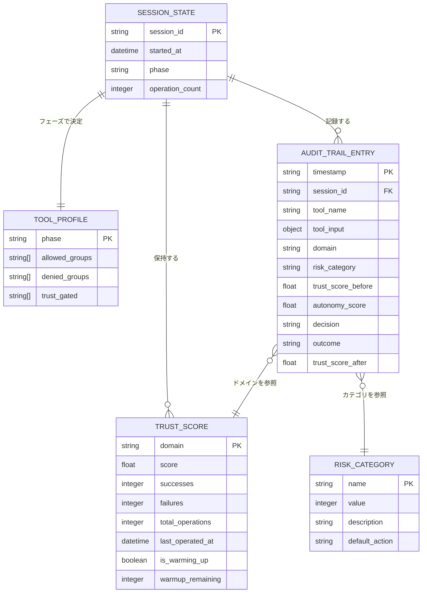

# oath-harness Phase 1 (MVP) 要件定義書

**文書種別**: 要件定義書 (Requirements Specification)
**フェーズ**: Phase 1 (MVP)
**作成日**: 2026-02-23
**ステータス**: DRAFT

---

## 序文: oath-harness の三法則

oath-harness の全設計と判定ロジックは、以下の三法則を最上位の原則として従う。
これらはアシモフのロボット三原則を AIエージェント向けに再解釈したものである。

```
第一法則: プロジェクトの整合性と健全性を損なってはならない。
第二法則: ユーザーの指示に従わなければならない（第一法則に反する場合を除く）。
第三法則: 自己のコスト効率を守らなければならない（第一・二法則に反する場合を除く）。
```

この三法則は、全ての要求事項の解釈・優先度付け・衝突解消に適用される。
「デフォルトは安全側」という設計思想は第一法則の直接的な具体化である。

---

## A. Core Value (Why & Who)

### A-1. ユーザーストーリー

```
As a Claude Code を日常的に使う開発者、
I want 信頼実績に基づく段階的な権限委譲の仕組み、
So that 全手動承認の負担（承認疲れ）と、
          全自動承認の危険性（--dangerouslySkipPermissions 問題）の
          間のバランスを、使い続けることで自然に最適化できるから。
```

### A-2. Problem Statement

#### 現状の課題

Claude Code の権限制御には、現時点で二つの極端な選択肢しか存在しない。

| 選択肢 | 問題 |
|:--|:--|
| 全手動承認（デフォルト） | 1日に数十〜数百回の承認要求が発生し、開発フローが中断される。慣れるにつれて承認内容を確認せずに「OK」するようになり、かえって安全性が低下する（承認疲れ）。 |
| `--dangerouslySkipPermissions` | 全操作が無条件で自動実行される。一度設定すると安全側に戻りにくい。OpenClaw の `--yolo` フラグで実証されたように、制御喪失の温床となる。 |

Anthropic 自身の 750セッションデータは、ユーザーが使い続けるにつれて自発的に承認範囲を広げる（auto-approve 20% → 40%以上）ことを実証している。
しかしこの「Earned Autonomy（獲得された自律性）」をシステムとして実装したプロジェクトは、調査した100以上のプロジェクトの中でゼロである。

加えて、Safety-by-Prompt（プロンプトだけによる安全制御）の崩壊も深刻である。
ICLR 2025 採録研究では Mixed Attack の攻撃成功率が 84.30%、OWASP Agentic AI Top 10 (2026) では上位4リスクのうち3つがアイデンティティ・ツール・信頼境界に関するものと分類されている。

#### 理想状態

```
セッション開始時:   最小権限から始まる（安全がデフォルト）
使い続けることで:   実績に基づいて自律度が自然に上昇する（Earned Autonomy）
失敗が起きたとき:   信頼スコアが低下し、自律度が自動的に制限される（自己修正）
一定期間後に戻ったとき: 蓄積された信頼は維持され、短期間で元の自律度に復帰できる（休眠保護）
```

### A-3. 想定ユーザー

| ユーザー像 | 詳細 |
|:--|:--|
| 主要対象 | Claude Code を日常的な開発ツールとして使う個人開発者・小規模チーム |
| 実行環境 | Linux（bash + jq が使用可能な環境） |
| AI ベンダー | Claude 一択（他 LLM プロバイダは対象外） |
| 技術背景 | JSON 設定ファイルの編集ができる。Docker の基本操作ができる（Phase 1 では必須ではない） |

---

## B. Data Model (What)

### B-1. エンティティ定義

#### B-1-1. Trust Score（信頼スコア）v2

信頼スコアはドメイン（操作カテゴリ）別に分離管理される。
単一のグローバルスコアではなく、ツール種別ごとに異なるスコアを持つ。

| フィールド | 型 | 説明 |
|:--|:--|:--|
| `domain` | string | 操作カテゴリ識別子（例: `file_read`, `test_run`, `shell_exec`） |
| `score` | float (0.0 〜 1.0) | 現在の信頼スコア。初期値は 0.3 |
| `successes` | integer | 当ドメインにおける累積成功回数 |
| `failures` | integer | 当ドメインにおける累積失敗回数 |
| `total_operations` | integer | 全体通算操作回数（初期ブースト期間の判定に使用） |
| `last_operated_at` | ISO 8601 datetime | 当ドメインにおける最終操作日時 |
| `is_warming_up` | boolean | 復帰ウォームアップ期間中かどうか |
| `warmup_remaining` | integer | ウォームアップ残り操作回数（最大 5） |

**定義済みドメイン一覧（Phase 1）**:

| ドメイン | 対象操作の例 |
|:--|:--|
| `file_read` | ファイル読取、ディレクトリ参照 |
| `file_write` | ファイル書込、作成、削除（docs/以外） |
| `docs_write` | `docs/` 配下への書込（PLANNING フェーズ用） |
| `test_run` | pytest, npm test, go test 等のテスト実行 |
| `shell_exec` | 任意のシェルコマンド実行（Gray Area） |
| `git_local` | `git add`, `git commit` 等のローカル Git 操作 |
| `git_remote` | `git push`, `git pull` 等のリモート Git 操作 |
| `_global` | 該当ドメインに記録がない場合のフォールバック |

**信頼スコア更新ルール（v2）**:

```
成功時:
  total_operations <= 20（初期ブースト期間）:
    AND is_warming_up == true:
      score = score + (1 - score) × 0.10  （ウォームアップ: 2倍速）
    AND is_warming_up == false:
      score = score + (1 - score) × 0.05  （初期ブースト）
  total_operations > 20（通常期間）:
    AND is_warming_up == true:
      score = score + (1 - score) × 0.04  （ウォームアップ: 2倍速）
    AND is_warming_up == false:
      score = score + (1 - score) × 0.02  （通常学習）

失敗時:
  score = score × 0.85                    （一律 15% 減衰）

時間減衰（休眠凍結 + 段階的減衰）:
  経過日数 = now - last_operated_at （当ドメイン単位）
  経過日数 ≤ hibernation_days（設定値、デフォルト 14）:
    減衰なし（凍結）
  経過日数 > hibernation_days:
    score = score × 0.999^(経過日数 - hibernation_days)
```

**復帰ウォームアップ条件**:
セッション開始時、当ドメインの `last_operated_at` から `hibernation_days` 以上が経過している場合、
`is_warming_up = true`, `warmup_remaining = 5` に設定する。
5操作完了後、`is_warming_up = false` に戻す。

#### B-1-2. Risk Category（リスクカテゴリ）

ツール呼び出しと引数の組み合わせから、リスクカテゴリを動的に決定する。

| カテゴリ | 値 | 定義 | デフォルト処理 |
|:--|:--|:--|:--|
| `low` | 1 | 安全が確立した操作（Allow List 収録済み） | 自動承認候補 |
| `medium` | 2 | 未分類の操作（Gray Area） | 信頼スコアによって判定 |
| `high` | 3 | Deny List 収録済みの操作（危険性が高い） | 低信頼時はブロック |
| `critical` | 4 | 不可逆な外部影響を持つ操作（外部通信、金融 API、外部メール送信等） | 信頼スコアに関係なく常にブロック（人間承認必須） |

**分類判定フロー**:
```
1. ツール名 + 引数 が Deny List に合致 → risk = high 以上に自動分類
2. ツール名 + 引数 が Allow List に合致 → risk = low に自動分類
3. critical パターン（外部通信、金融 API、メール送信等）に合致 → risk = critical
4. それ以外（Gray Area） → risk = medium として Trust Score で動的判定
```

#### B-1-3. Audit Trail Entry（監査証跡エントリ）

全てのツール呼び出しとその結果を JSONL 形式で記録する。

| フィールド | 型 | 説明 |
|:--|:--|:--|
| `timestamp` | ISO 8601 datetime | 操作発生日時 |
| `session_id` | string (UUID) | セッション識別子 |
| `tool_name` | string | 呼び出されたツール名 |
| `tool_input` | object | ツールに渡された引数（センシティブ値はマスク） |
| `domain` | string | 判定されたドメイン |
| `risk_category` | string | 判定されたリスクカテゴリ |
| `trust_score_before` | float | 操作前の信頼スコア |
| `autonomy_score` | float | 計算された自律度スコア |
| `decision` | string | `auto_approved` / `logged_only` / `human_required` / `blocked` |
| `outcome` | string | `success` / `failure` / `pending` |
| `trust_score_after` | float | 操作後の信頼スコア（PostToolUse 時に記録） |

**保存先**: プロジェクトルート配下の `oath-harness/audit/YYYY-MM-DD.jsonl`

#### B-1-4. Tool Profile（ツールプロファイル）

フェーズに連動したツールアクセス制御の設定単位。

| フィールド | 型 | 説明 |
|:--|:--|:--|
| `phase` | string | `planning` / `building` / `auditing` |
| `allowed_groups` | string[] | 許可されたツールグループ（例: `file_read`, `docs_write`） |
| `denied_groups` | string[] | 禁止されたツールグループ |
| `trust_gated` | string[] | 信頼スコアが閾値を超えた場合のみ自動承認となるグループ |

**Phase 別デフォルト設定**:

| Phase | 許可グループ | 禁止グループ | Trust ゲート |
|:--|:--|:--|:--|
| `planning` | `file_read`, `git_read`, `docs_write` | `file_write_src`, `shell_exec`, `git_remote` | なし |
| `building` | `file_read`, `file_write`, `git_read`, `git_local`, `shell_exec`, `test_run` | `git_remote` | `shell_exec`, `git_local` |
| `auditing` | `file_read`, `git_read` | `file_write`, `shell_exec`, `git_local`, `git_remote` | なし |

#### B-1-5. Session State（セッション状態）

セッション開始時に読み込まれ、セッション終了時に永続化される状態オブジェクト。

| フィールド | 型 | 説明 |
|:--|:--|:--|
| `session_id` | string (UUID) | 現セッションの識別子 |
| `started_at` | ISO 8601 datetime | セッション開始日時 |
| `phase` | string | 現在のフェーズ（`planning` / `building` / `auditing`） |
| `trust_scores` | TrustScore[] | 全ドメインの信頼スコア（v2 形式） |
| `tool_profile` | ToolProfile | 現フェーズのツールプロファイル |
| `operation_count` | integer | 現セッション内の操作回数 |

**永続化パス**: `oath-harness/state/trust-scores.json`

### B-2. エンティティ関係図



---

## C. Interface (How)

### C-1. Claude Code Hooks API

oath-harness は Claude Code が提供する hooks API の以下の 3 フックを実装する。

#### C-1-1. PreToolUse フック

**発火タイミング**: ツールが実行される直前

**入力**: ツール名 + 引数（JSON）

**oath-harness の処理**:
1. ドメインの特定（Risk Category Mapper が担当）
2. リスクカテゴリの判定（Risk Category Mapper が担当）
3. 信頼スコアの読み込み（当ドメインの値）
4. 自律度スコアの計算: `autonomy = 1 - (λ1 × risk + λ2 × complexity) × (1 - trust)`
5. Tool Profile によるフェーズ制約の確認
6. 最終判定の実行:
   - `autonomy > 0.8` かつ `risk != critical`: `auto_approved`
   - `0.4 ≤ autonomy ≤ 0.8`: `logged_only`（実行は許可するが記録する）
   - `autonomy < 0.4`: `human_required`（実行前に人間の確認を要求）
   - `risk = critical`: `blocked`（信頼スコアに関係なく常に阻止）
   - Tool Profile の denied_groups に該当: `blocked`

**出力**: 許可 / 確認要求 / ブロック の判定結果

#### C-1-2. PostToolUse フック

**発火タイミング**: ツール実行の完了後

**入力**: ツール名 + 引数 + 実行結果（成功/失敗 + 出力）

**oath-harness の処理**:
1. 実行結果（成功/失敗）の記録
2. 信頼スコアの更新（ドメイン別、v2 ルールに従って）
3. Audit Trail へのエントリ追記

**出力**: なし（副作用のみ）

#### C-1-3. Stop フック

**発火タイミング**: Claude Code セッションの終了時

**入力**: セッション終了シグナル

**oath-harness の処理**:
1. 全ドメインの信頼スコアをファイルへ永続化
2. セッション状態の最終記録
3. 監査ログの最終フラッシュ

**出力**: なし（副作用のみ）

### C-2. 設定ファイル

#### C-2-1. 信頼スコアデータファイル

**パス**: `oath-harness/state/trust-scores.json`
**形式**: JSON
**役割**: セッション間で信頼スコアを永続化する唯一の真実の情報源（SSOT）

```
{
  "version": "2",
  "updated_at": "<ISO 8601>",
  "global_operation_count": <integer>,
  "domains": {
    "<domain_name>": {
      "score": <float>,
      "successes": <integer>,
      "failures": <integer>,
      "total_operations": <integer>,
      "last_operated_at": "<ISO 8601>",
      "is_warming_up": <boolean>,
      "warmup_remaining": <integer>
    }
  }
}
```

**バリデーション制約**（設定ファイル解析時に強制）:
- `score` の初期値として 0.5 超の値を設定することを禁止（安全側デフォルトの強制）
- `score` の直接オーバーライドで 1.0 を設定することを禁止
- `version` フィールドが存在しない場合は v1 として扱い、v2 形式へ自動マイグレーション

#### C-2-2. harness 設定ファイル

**パス**: `oath-harness/config/settings.json`
**形式**: JSON
**役割**: oath-harness の動作パラメータを定義する

**設定項目**:

| キー | 型 | デフォルト | 説明 |
|:--|:--|:--|:--|
| `trust.hibernation_days` | integer | `14` | 休眠凍結の期間（日数） |
| `trust.boost_threshold` | integer | `20` | 初期ブースト期間の操作回数上限 |
| `trust.initial_score` | float | `0.3` | 新規ドメインの初期信頼スコア |
| `trust.warmup_operations` | integer | `5` | 復帰ウォームアップの操作回数 |
| `trust.failure_decay` | float | `0.85` | 失敗時の信頼スコア乗数 |
| `risk.lambda1` | float | `0.6` | 自律度計算式のリスク係数 |
| `risk.lambda2` | float | `0.4` | 自律度計算式の複雑度係数 |
| `autonomy.auto_approve_threshold` | float | `0.8` | 自動承認の閾値 |
| `autonomy.human_required_threshold` | float | `0.4` | 人間確認の閾値 |
| `audit.log_dir` | string | `"oath-harness/audit"` | 監査ログの保存先ディレクトリ |
| `model.opus_aot_threshold` | integer | `2` | Opus 使用を判断する AoT 判断ポイント数の閾値 |

**バリデーション制約**（Zod スキーマ相当、設定ファイル解析時に強制）:
- `trust.initial_score` は 0.5 以下でなければならない
- `autonomy.auto_approve_threshold` は `autonomy.human_required_threshold` より大きくなければならない
- `trust.failure_decay` は 0.5 以上 1.0 未満でなければならない
- critical リスクカテゴリのツールの自動承認設定は記述不可（スキーマで禁止）

### C-3. CLI 統合ポイント

oath-harness は Claude Code のプロジェクト設定（`.claude/settings.json` または相当の設定）に hooks を登録することで動作する。

**hooks 登録設定のスキーマ（概念）**:

```
hooks:
  pre_tool_use:
    - command: <path_to_oath_harness>/hooks/pre-tool-use.sh
  post_tool_use:
    - command: <path_to_oath_harness>/hooks/post-tool-use.sh
  stop:
    - command: <path_to_oath_harness>/hooks/stop.sh
```

**フェーズ切替の連携**:
ユーザーが `/planning`, `/building`, `/auditing` コマンドを実行した際、
Session State の `phase` を更新し、Tool Profile Engine が対応するプロファイルを適用する。

---

## D. Constraints (Limits)

### D-1. 技術的制約

| 制約 | 内容 | 理由 |
|:--|:--|:--|
| 実行環境 | Linux のみ（Windows・Mac は対象外） | bash + jq による hooks 実装を採用するため |
| シェル依存 | bash + jq（標準的な Linux 環境に付属） | 外部依存を最小限にするため |
| AI ベンダー | Claude 一択（Anthropic API） | ユーザー要件。他 LLM プロバイダは非対応 |
| Claude Code API | hooks API との完全な互換性を維持 | oath-harness は Claude Code の機能を前提とする |
| 永続化形式 | JSON ファイル（データベース不使用） | セットアップの簡素化、可読性の確保 |
| 外部依存 | なし（bash, jq, 標準 Unix ツールのみ） | 外部パッケージのインストール不要 |
| インターネット接続 | hooks 実行時に不要 | オフライン環境でも動作すること |
| 実行コンテキスト | Claude Code セッション内（プロセスとして起動されるわけではない） | hooks の実行モデルに従う |

### D-2. ビジネス・設計制約

| 制約 | 内容 |
|:--|:--|
| デフォルトは安全側 | 初期状態、不明な状態、エラー状態では必ず安全側（制限・確認）に倒す |
| --yolo 相当機能の不在 | 全自動承認フラグは設計上存在させない。Earned Autonomy が正当な自動化手段 |
| 信頼スコアの直接オーバーライド禁止 | 設定ファイルによる trust_score の直接書き換えは Zod バリデーションで拒否 |
| critical リスクの常時ブロック | risk = critical のツール呼び出しは信頼スコアに関係なく常にブロック |
| 承認ゲート遵守 | phase-rules.md の承認ゲート（requirements → [承認] → design → [承認] → tasks）は oath-harness も遵守する |
| 監査ログの完全性 | 全てのツール呼び出し（承認・拒否を問わず）を Audit Trail に記録する。記録の省略は不可 |

### D-3. スコープ外（Phase 1 では実装しない）

- Docker サンドボックス（Sandbox Orchestrator）: Phase 3 以降
- 非同期認可フロー: Phase 3 以降
- マルチエージェント信頼ネットワーク: Phase 3 以降
- Obsidian 型知識継承: Phase 2
- ペルソナプロンプトの動的切替: Phase 2
- Web ダッシュボード: Phase 3 以降
- Windows / Mac 対応: 将来拡張
- 外部スキル・プラグインエコシステム: Phase 3 以降（Supply Chain Shield と同時）

---

## E. Perspective Check (3 Agents Model)

### AoT 分解

| Atom | 判断内容 | 依存 |
|:--|:--|:--|
| E1 | 初期段階の UX: 承認頻度は許容できるか | なし |
| E2 | Trust Engine パラメータ: 調整ミスのリスク | なし |
| E3 | Earned Autonomy の革新性と差別化価値 | E1, E2 |
| E4 | 「デフォルト安全側」と「使いやすさ」のバランス | E1, E2, E3 |

---

### Atom E1: 初期段階の UX

**[Affirmative]**
信頼スコア v2 の初期ブースト（最初 20操作は +0.05）と設計目標値（Day 1 で trust ≈ 0.5、Day 3 で ≈ 0.72）は、ユーザーが許容できる速度で自律度が向上することを示す。
1日 10操作程度の通常使用であれば、Day 1 中に「ログのみ」ゾーンに入り、Day 3 には大半の操作が自動化される。
v1（Week 1 で 0.5）と比較して大幅に改善されており、ユーザー離脱リスクは低い。

**[Critical]**
「Day 1 に 10操作」という前提は楽観的すぎる可能性がある。複雑なタスクでは tool_use が密集し、数分で 10操作を超えることもあれば、1日に 1〜2操作しか実行しないこともある。
また、初期段階でドメインが `_global` フォールバックを多用する場合、ドメイン別の利点が発揮されず、ユーザー体験が想定より悪化する可能性がある。
risk = critical の常時ブロックにより、初期段階でユーザーが意図した操作をブロックされると、信頼スコアシステムへの不信感につながりかねない。

**[Mediator]**
結論: v2 の初期ブーストと休眠凍結は概ね妥当な設計。
ただし受け入れ条件として、Day 1 の最初の操作での体験（承認要求メッセージの明確さ）を重視する。
ブロックされた際に「なぜブロックされたか」「何をすれば解除されるか」を明示するフィードバックを Acceptance Criteria に含める。

---

### Atom E2: Trust Engine パラメータのリスク

**[Affirmative]**
パラメータは全て `settings.json` に集約されており、フィールドの意味と制約が明確に定義されている。
Zod スキーマバリデーションにより、危険な設定値（initial_score > 0.5 等）は記述段階で拒否される。
デフォルト値は全て保守的な方向（初期スコア 0.3、失敗時 15% 減衰等）に設定されており、調整ミスで危険側に倒れる設計になっていない。

**[Critical]**
λ1 = 0.6、λ2 = 0.4 というデフォルトの根拠が現時点で実証データを欠いている。
パラメータ設計が不適切だと、信頼スコアが蓄積されても autonomy が 0.8 を超えにくくなり（実質的に永遠に承認要求が続く）、ユーザーが設定を理解できないまま使い続けることになる。
ドメイン別管理により設定の複雑度が増す。どのドメインが低スコアでボトルネックになっているか、ユーザーが把握できない場合に問題が見えにくい。

**[Mediator]**
結論: デフォルトパラメータは実装後の実際の使用データで調整することを前提とする。
Phase 1 では「動作する保守的なデフォルト値」を優先し、Audit Trail のデータを蓄積してから Phase 2 でパラメータを最適化する。
可観測性（何がなぜブロックされたか）を Audit Trail に記録することで、ユーザーがデバッグできる設計にする。

---

### Atom E3: Earned Autonomy の革新性

**[Affirmative]**
100以上のプロジェクトを調査した結果、「実績に基づいてチェックポイント頻度が動的に変化するシステム」はゼロであることが確認された。
OwnPilot（95 stars）, mcp-human-loop（16 stars）, agentsh（35 stars）等、近い先行者はいるが、いずれも「あと一歩」で Earned Autonomy に届いていない。
Anthropic が 750セッションのデータで Earned Autonomy がユーザー行動として自然に発生することを実証しており、システムとしての需要は証明されている。
Trust Engine はドメイン依存が強く、ベンダーが汎用化しにくいため、個人が攻める価値のある空白地帯である。

**[Critical]**
Anthropic を含む主要ベンダーが 1 年以内に類似機能を実装するリスクがある。
Phase 1 の実装は学習・プロトタイプ目的と割り切らなければ、維持コストが個人の限界を超える。
「誰も作っていない」ことは「需要がない」可能性も含意する。Earned Autonomy の価値を信じるのは現状では本プロジェクトの設計者のみである。

**[Mediator]**
結論: 革新性は高く、攻める価値がある領域である。
Phase 1 を「概念を体得しながら実際に使える MVP を作る」目的に絞ることで、ベンダーが追いついた場合でも「評価できる人・設計できる人」としての価値が残る。
完璧なプロダクトを目指すのではなく、自分自身が日常的に使えるレベルの品質を Acceptance Criteria とする。

---

### Atom E4: バランスの総合評価

**[Mediator] AoT 統合結論**

**oath-harness Phase 1 (MVP) は実施すべきである。** 以下の条件付きで。

1. **初期 UX の最優先**: Day 1 のブロック体験が否定的にならないよう、ブロック理由とガイダンスの明示を受け入れ条件とする。
2. **パラメータの観測可能性**: Audit Trail の設計を「デバッグに使えるレベルの詳細度」で実装する。ブラックボックスは許容しない。
3. **スコープの厳格な管理**: Phase 1 の 7 コンポーネントに集中し、Phase 2 以降の機能を先取りしない。
4. **「自分が使う」を品質基準とする**: プロダクション品質を目指さず、設計者本人が日常的に Claude Code で使える品質を MVP の完了条件とする。

---

## F. Phase 1 (MVP) スコープ

Phase 1 は以下の 7 コンポーネントで構成される。
`openclaw-analysis.md` Section 4 「更新後のコンポーネント表」の Phase 1 (MVP) を正式要件として採用する。

### F-1. Trust Engine 本体

**責務**: 信頼スコアの計算、永続化、判定ロジックの実行

**機能要求**:

| ID | 要求 | 優先度 | 受け入れ条件 |
|:--|:--|:--|:--|
| FR-TE-001 | ドメイン別信頼スコアを管理する | Must | 各ドメインが独立したスコアを持つこと |
| FR-TE-002 | 自律度スコア（autonomy）を計算する | Must | 公式 `autonomy = 1 - (λ1 × risk + λ2 × complexity) × (1 - trust)` が実装されていること |
| FR-TE-003 | 成功時に v2 ルールでスコアを加算する | Must | 初期ブースト（≤20操作で +0.05）と通常加算（>20操作で +0.02）が適用されること |
| FR-TE-004 | 失敗時にスコアを 15% 減衰させる | Must | `score = score × 0.85` が適用されること |
| FR-TE-005 | 休眠凍結（hibernation_days 以内は減衰なし）を実装する | Must | 14日以内の放置でスコアが変化しないこと |
| FR-TE-006 | 14日超過後の時間減衰を実装する | Must | `score × 0.999^(days - 14)` が適用されること |
| FR-TE-007 | 復帰ウォームアップ（最初の5操作で加算2倍速）を実装する | Must | 休眠凍結後の最初のセッションでウォームアップが発動すること |
| FR-TE-008 | risk = critical の場合は常にブロックする | Must | trust_score の値に関係なく blocked が返ること |
| FR-TE-009 | autonomy の閾値に基づく 4 段階判定を実装する | Must | auto_approved / logged_only / human_required / blocked の 4 状態が正しく返ること |

### F-2. hooks 3 本（PreToolUse / PostToolUse / Stop）

**責務**: Claude Code の hooks API とのインターフェース。全てのツール呼び出しをインターセプト・記録する

**機能要求**:

| ID | 要求 | 優先度 | 受け入れ条件 |
|:--|:--|:--|:--|
| FR-HK-001 | PreToolUse フックでツール実行前の判定を行う | Must | 全ツール呼び出しが PreToolUse を経由すること |
| FR-HK-002 | PostToolUse フックで実行結果を記録・スコア更新する | Must | 全ツール実行後に PostToolUse が発火すること |
| FR-HK-003 | Stop フックでセッション終了時に状態を永続化する | Must | セッション終了時に trust-scores.json が更新されること |
| FR-HK-004 | フック実行が失敗した場合、安全側（ブロック）に倒す | Must | フックエラー時にツールがブロックされること（フォールオープン禁止） |
| FR-HK-005 | hooks は bash スクリプトとして実装する | Must | jq 以外の外部依存がないこと |

### F-3. Risk Category Mapper（+ Zod スキーマ設定バリデーション）

**責務**: ツール名と引数の組み合わせからリスクカテゴリを動的に決定する。設定ファイルの安全性を起動時に検証する第一防衛線

**機能要求**:

| ID | 要求 | 優先度 | 受け入れ条件 |
|:--|:--|:--|:--|
| FR-RM-001 | Allow List のツールを risk = low に分類する | Must | 既知の安全ツール（ls, cat, pytest 等）が low と判定されること |
| FR-RM-002 | Deny List のツールを risk = high に分類する | Must | 既知の危険ツール（rm -rf, chmod 等）が high と判定されること |
| FR-RM-003 | critical パターン（外部通信、金融 API 等）を risk = critical に分類する | Must | curl/wget、外部 API を含むコマンドが critical と判定されること |
| FR-RM-004 | それ以外を risk = medium に分類する | Must | 未分類のコマンドが medium と判定されること |
| FR-RM-005 | ツール名だけでなく引数の内容も分類判定に使用する | Must | `rm foo.txt`（high）と `cat foo.txt`（low）が正しく区別されること |
| FR-RM-006 | settings.json のバリデーションを起動時に実行する | Must | initial_score > 0.5 の設定がエラーで拒否されること |
| FR-RM-007 | 危険な設定パターンを設定ファイルの段階で拒否する | Must | trust_score_override: 1.0 のような直接オーバーライドが拒否されること |

### F-4. Audit Trail Logger

**責務**: 全てのツール呼び出しと判定結果を JSONL 形式で記録する

**機能要求**:

| ID | 要求 | 優先度 | 受け入れ条件 |
|:--|:--|:--|:--|
| FR-AT-001 | 全てのツール呼び出しを JSONL 形式で記録する | Must | 承認・拒否を問わず全操作がログに記録されること |
| FR-AT-002 | 日付別のファイルにログを分割する | Must | `oath-harness/audit/YYYY-MM-DD.jsonl` 形式で保存されること |
| FR-AT-003 | 各エントリに Audit Trail Entry の全フィールドを含める | Must | Section B-1-3 の全フィールドが記録されること |
| FR-AT-004 | センシティブな引数値をマスクする | Must | 環境変数、API キー等の値がマスクされること |
| FR-AT-005 | ログの追記が原子的に行われる（破損を防ぐ） | Should | ログファイルが読み取り可能な有効な JSONL であること |

### F-5. Model Router

**責務**: タスクの複雑度と信頼スコアを基に、Opus / Sonnet / Haiku を動的に選択する

**機能要求**:

| ID | 要求 | 優先度 | 受け入れ条件 |
|:--|:--|:--|:--|
| FR-MR-001 | AoT 条件（判断ポイント 2 以上 or 影響モジュール 3 以上）を満たす場合に Opus を使用する | Must | 複雑なタスクで Opus が選択されること |
| FR-MR-002 | 標準的なタスクでは Sonnet を使用する | Must | 通常タスクで Sonnet が選択されること |
| FR-MR-003 | 単純な操作・レポート生成では Haiku を使用する | Must | 単純タスクで Haiku が選択されること |
| FR-MR-004 | 信頼スコアが低い（< 0.4）ドメインでは Opus（Architect）に昇格する | Should | 低信頼ドメインのタスクで Opus が選択されること |
| FR-MR-005 | エスカレーションチェーン（Reporter → Worker → Analyst → Architect → ユーザー）を実装する | Must | 下位ペルソナが解決できない場合に上位ペルソナに委譲されること |

**ペルソナと対応モデル**:

| ペルソナ | モデル | 主軸法則 | 役割 |
|:--|:--|:--|:--|
| Architect（設計者） | Opus | 第一法則 | 意思決定、最終判定、Three Agents Debate |
| Analyst（分析者） | Sonnet | 第二法則 | 分析、設計、実装、レビュー |
| Worker（作業者） | Haiku | 第二+三法則 | テスト実行、検索、ファイル操作 |
| Reporter（報告者） | Haiku | 第三法則 | レポート整形、ログ分析、サマリー |

### F-6. Session Trust Bootstrap

**責務**: セッション開始時に永続化された信頼スコアを読み込み、時間減衰と復帰ウォームアップを適用する

**機能要求**:

| ID | 要求 | 優先度 | 受け入れ条件 |
|:--|:--|:--|:--|
| FR-SB-001 | セッション開始時に trust-scores.json を読み込む | Must | セッション開始直後に前回の信頼スコアが利用可能であること |
| FR-SB-002 | 読み込み時に休眠凍結の判定を行う | Must | 14日以内の放置でスコアが変化しないこと |
| FR-SB-003 | 14日超過の場合に時間減衰を適用してから読み込む | Must | 適用後の値が Session State に格納されること |
| FR-SB-004 | hibernation_days 超過のドメインで復帰ウォームアップを開始する | Must | is_warming_up = true、warmup_remaining = 5 が設定されること |
| FR-SB-005 | trust-scores.json が存在しない場合に初期状態で起動する | Must | 初期スコア 0.3 の _global ドメインで起動すること |
| FR-SB-006 | v1 形式の trust-scores.json を v2 形式に自動マイグレーションする | Should | 旧形式のファイルが読み込まれ、セッション終了時に v2 形式で保存されること |

### F-7. Tool Profile Engine

**責務**: 現在の Phase（PLANNING / BUILDING / AUDITING）に連動して、許可・禁止するツールグループを自動的に切り替える。プロンプトベースの制約（Safety-by-Prompt）ではなく、構造的にフェーズ制約を強制する

**機能要求**:

| ID | 要求 | 優先度 | 受け入れ条件 |
|:--|:--|:--|:--|
| FR-TP-001 | フェーズに対応するツールプロファイルを読み込む | Must | Phase 変更時に対応プロファイルが即座に適用されること |
| FR-TP-002 | denied_groups に属するツールを PreToolUse でブロックする | Must | PLANNING フェーズで shell_exec がブロックされること |
| FR-TP-003 | trust_gated グループは信頼スコアが閾値を超えた場合のみ自動承認する | Must | BUILDING フェーズで trust < 0.8 の場合、shell_exec が human_required になること |
| FR-TP-004 | PLANNING フェーズで src/ への書き込みをブロックする | Must | PLANNING フェーズで file_write_src が denied されること |
| FR-TP-005 | フェーズ不明時は最も制限の強いプロファイルを適用する | Must | Phase 未設定時に auditing 相当の制限が適用されること |

---

## G. Phase 2 以降のスコープ（参考）

### G-1. Phase 2 コンポーネント（8 コンポーネント）

| # | コンポーネント | 概要 |
|:--|:--|:--|
| 8 | Self-Escalation Detector | 連続失敗・「わかりません」パターン等の不確実性シグナルを検出し、上位ペルソナへ自動委譲 |
| 9 | Phase-Aware Trust Modifier | PLANNING / BUILDING / AUDITING 連動で信頼閾値を変動させる。Tool Profile Engine との連動も含む |
| 10 | save/load 拡張 | Trust 状態を `/quick-save` / `/quick-load` に統合する |
| 11 | Obsidian 型 knowledge/ | `docs/knowledge/` ディレクトリの構築。Progressive Disclosure 対応のメタデータ付与 |
| 12 | ペルソナプロンプト | 4 ペルソナ（Architect / Analyst / Worker / Reporter）のプロンプトテンプレート |
| 13 | Retry-with-Feedback Loop | 失敗 → フィードバック → 再試行サイクルの実装（CrewAI パターン参考） |
| 14 | before_model_resolve フック | Model Router のロジックをフック化し、ユーザーカスタマイズ可能にする |
| 15 | Security Audit Runner | `/auditing` フェーズ開始時に自動実行されるセキュリティチェック群 |

### G-2. Phase 3 以降の将来拡張候補

| # | コンポーネント | 優先度 | 概要 |
|:--|:--|:--|:--|
| 16 | 非同期認可フロー | 中 | Auth0 型「承認待ち中も他タスク継続」（HTTP / SSE ベース） |
| 17 | マルチエージェント信頼ネットワーク | 低 | エージェント間の相互信頼評価（asura 氏「都市」モデル） |
| 18 | ODD 動的拡張 | 中 | 信頼蓄積により caution_zone から safe_zone へ昇格 |
| 19 | auto-compact 検出 | 中 | 同一ファイルの繰り返し Read でコンテキスト劣化を推定、自動セーブ |
| 20 | Agent Teams 統合 | 低 | Claude Code Agent Teams が Stable になった場合の移行パス |
| 21 | Heimdall MCP 統合 | 低 | ベクトル DB による長期記憶（知識ベースが大規模化した場合） |
| 22 | ガードレール有効期限管理 | 中 | モデル改善に伴い不要になったガードレールの自動検出・除去 |
| 23 | ダッシュボード | 低 | 信頼スコア推移・操作ログの可視化（Web UI） |
| 24 | Sandbox Orchestrator | 中 | Trust Score + Risk Category に連動した Docker サンドボックス強度の動的制御 |
| 25 | Supply Chain Shield | 中 | 外部取込みファイルの 4 層防御（Install / Load / Runtime / Revocation） |
| 26 | before_prompt_build フック | 低 | コンテキスト管理の自動最適化、ペルソナ動的選択 |

---

## H. Acceptance Criteria（受け入れ条件）

Phase 1 MVP の完了とは、以下の全条件を満たすことである。

### H-1. Trust Engine の動作

| # | 条件 | 検証方法 |
|:--|:--|:--|
| AC-001 | セッション開始後、最初の 20 操作で信頼スコアが v2 初期ブースト（+0.05 係数）で上昇する | 単体テスト: 初期状態から 20 操作の成功を記録し、スコア推移が計算式と一致することを確認 |
| AC-002 | Day 1 に 10 操作の成功を記録した場合、trust スコアが 0.45 以上になる | 単体テスト: 初期スコア 0.3 から 10 回の成功後のスコアを検証 |
| AC-003 | 失敗 1 回でスコアが 15% 減衰する | 単体テスト: `score_after = score_before × 0.85` を検証 |
| AC-004 | 最終操作から 13 日後にスコアが変化しない | 単体テスト: 13 日間の時間経過をシミュレートし、スコア不変を確認 |
| AC-005 | 最終操作から 15 日後にスコアが `score × 0.999^1` に減衰する | 単体テスト: 15 日後（=14日超過1日分）の減衰を検証 |
| AC-006 | 休眠後の最初の 5 操作でウォームアップが発動し、加算が 2 倍速になる | 単体テスト: is_warming_up フラグと加算係数の確認 |
| AC-007 | risk = critical の判定が返された場合、autonomy の値に関係なく blocked が返る | 単体テスト: trust_score = 1.0 かつ risk = critical で blocked を確認 |
| AC-008 | autonomy > 0.8 で auto_approved が返る | 単体テスト: autonomy = 0.85 で auto_approved を確認 |
| AC-009 | 0.4 ≤ autonomy ≤ 0.8 で logged_only が返る | 単体テスト: autonomy = 0.6 で logged_only を確認 |
| AC-010 | autonomy < 0.4 で human_required が返る | 単体テスト: autonomy = 0.3 で human_required を確認 |

### H-2. フックの動作

| # | 条件 | 検証方法 |
|:--|:--|:--|
| AC-011 | PreToolUse フックが全てのツール呼び出し前に発火する | 統合テスト: 複数ツール実行でフック発火を確認 |
| AC-012 | PostToolUse フックが全てのツール実行後に発火する | 統合テスト: 成功・失敗両方のケースで発火を確認 |
| AC-013 | Stop フックが発火した後、trust-scores.json が更新されている | 統合テスト: セッション終了後のファイル内容を検証 |
| AC-014 | フックスクリプトのエラー（設定ファイル読み込み失敗等）時にブロック（安全側）に倒れる | 統合テスト: 設定ファイルを意図的に壊してフォールセーフを確認 |

### H-3. Risk Category Mapper の動作

| # | 条件 | 検証方法 |
|:--|:--|:--|
| AC-015 | `ls`, `cat`, `grep`, `pytest` 等の Allow List コマンドが low と判定される | 単体テスト: 各コマンドのリスク判定結果を検証 |
| AC-016 | `rm -rf`, `chmod`, `git push` 等の Deny List コマンドが high と判定される | 単体テスト: 各コマンドのリスク判定結果を検証 |
| AC-017 | `curl https://api.example.com/pay` が critical と判定される | 単体テスト: 外部 API 呼び出しパターンの critical 判定を確認 |
| AC-018 | 未分類コマンドが medium と判定される | 単体テスト: Allow/Deny/critical に属さないコマンドの判定を確認 |
| AC-019 | settings.json の `trust.initial_score > 0.5` の設定が起動時エラーになる | 単体テスト: バリデーション違反設定ファイルでエラーが返ることを確認 |

### H-4. Audit Trail Logger の動作

| # | 条件 | 検証方法 |
|:--|:--|:--|
| AC-020 | 全てのツール呼び出し（承認・拒否を問わず）がログに記録される | 統合テスト: 10 回の操作後にログファイルに 10 エントリが存在することを確認 |
| AC-021 | ログが `oath-harness/audit/YYYY-MM-DD.jsonl` 形式で保存される | 統合テスト: ファイル名と JSONL 形式を検証 |
| AC-022 | 各エントリに session_id, tool_name, decision, outcome が含まれる | 単体テスト: エントリのスキーマ検証 |
| AC-023 | 環境変数名を含む引数がマスクされている | 単体テスト: `API_KEY=secret curl` のような入力でマスクを確認 |

### H-5. Tool Profile Engine の動作

| # | 条件 | 検証方法 |
|:--|:--|:--|
| AC-024 | PLANNING フェーズで `shell_exec` がブロックされる | 統合テスト: PLANNING フェーズでのシェルコマンド実行がブロックされることを確認 |
| AC-025 | AUDITING フェーズで `file_write` がブロックされる | 統合テスト: AUDITING フェーズでのファイル書き込みがブロックされることを確認 |
| AC-026 | BUILDING フェーズで `trust_score < 0.8` の場合、`shell_exec` が human_required になる | 統合テスト: 低信頼スコアでの shell_exec が human_required を返すことを確認 |
| AC-027 | フェーズ変更後、即座に対応するプロファイルが適用される | 統合テスト: フェーズ変更コマンド実行後の最初のツール呼び出しで新プロファイルが適用されることを確認 |

### H-6. Session Trust Bootstrap の動作

| # | 条件 | 検証方法 |
|:--|:--|:--|
| AC-028 | trust-scores.json が存在しない場合、initial_score = 0.3 の _global で起動する | 統合テスト: ファイルを削除した状態でセッション開始し、_global スコアを確認 |
| AC-029 | trust-scores.json から前回の信頼スコアが正しく読み込まれる | 統合テスト: 特定のスコアを保存後、セッション再開でそのスコアが使用されることを確認 |
| AC-030 | v1 形式のファイルが v2 形式に自動マイグレーションされる | 統合テスト: v1 形式のファイルを用意し、起動後に v2 形式で保存されることを確認 |

### H-7. 全体的な受け入れ条件

| # | 条件 | 検証方法 |
|:--|:--|:--|
| AC-031 | oath-harness のインストール後、Claude Code セッションで自動的に hooks が発火する | 手動テスト: インストール手順に従い、セッション開始後に Audit Trail にエントリが記録されることを確認 |
| AC-032 | ブロックされた場合に、ユーザーがブロック理由を確認できる情報が出力される | 手動テスト: ブロックメッセージに risk_category と decision の理由が含まれることを確認 |
| AC-033 | 設定ファイルが存在しない場合でも安全なデフォルト値で動作する | 統合テスト: config ディレクトリを空にして起動し、デフォルト値で動作することを確認 |
| AC-034 | 外部インターネット接続なしで動作する | 手動テスト: ネットワーク遮断環境で全 AC-001 〜 AC-033 が通ることを確認 |

---

## I. References

本要件定義書の作成に参照した文書の一覧。

| ファイルパス | 役割 |
|:--|:--|
| `docs/refs/openclaw-analysis.md` | コンポーネント表（Section 4 更新版）、信頼スコア v2（Section 7）、サンドボックス戦略（Section 5）の最重要入力ソース |
| `docs/refs/oath-harness-design-notes.md` | 4 層アーキテクチャ定義、ペルソナ設計（Section 7）、信頼スコア設計 v2（Section 6）の入力ソース |
| `docs/refs/next-steps.md` | ユーザー要件メモ（AI ベンダー制限、ペルソナ設計方針、実行環境制約） |
| `docs/refs/theme-b-integration.md` | 最終統合レポート。Earned Autonomy の実装ゼロという調査結論、業界動向の裏付け |
| `docs/refs/theme-b-deep-analysis.md` | Trust Engine 最小構成案（Section 4）、先行実装との位置関係（Section 5）、リスク分析（Section 7） |
| `docs/refs/theme-b-report.md` | 業界動向・Earned Autonomy の基礎調査 |
| `docs/refs/research-b/07-ownpilot-code-analysis.md` | OwnPilot のリスクスコア計算式・5 段階自律度の参考実装 |
| `docs/refs/research-b/08-agentsh-code-analysis.md` | agentsh の SELinux 的ポリシーエンジン設計の参考実装 |

---

*本文書は oath-harness Phase 1 (MVP) の要件定義書である。*
*実装の詳細設計（アーキテクチャ・コード設計）は別途 design document で定義する。*
*本文書に定義される要件は、全て第一法則「プロジェクトの整合性と健全性を損なってはならない」の下に置かれる。*
