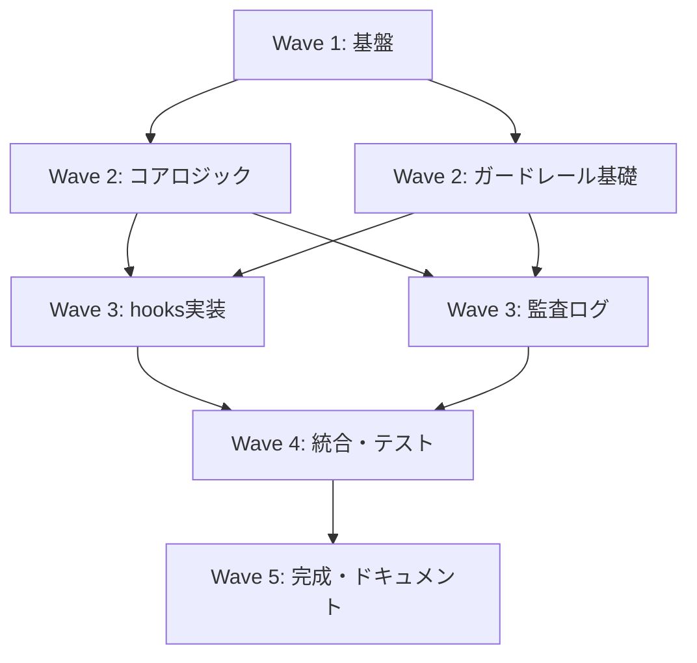

# oath-harness Phase 1 (MVP) タスク分解

**作成日**: 2026-02-23
**状態**: DRAFT - Task Decomposition
**参照仕様書**: `docs/specs/requirements.md`, `docs/specs/design.md`

---

## 概要

- **総タスク数**: 27
- **総Wave数**: 5
- **対象コンポーネント**: 7 (Trust Engine, hooks 3本, Risk Category Mapper, Audit Trail Logger, Model Router, Session Trust Bootstrap, Tool Profile Engine)
- **実装言語**: bash + jq
- **テストフレームワーク**: bats-core（git submodule）

---

## 依存関係グラフ



---

## Wave 1: 基盤構築（依存なし、並列可能）

### Task 1-1: ディレクトリ構造とファイルスケルトン作成

**対応コンポーネント**: 全体
**対応要件**: (インストール設計)
**対応AC**: なし（テスト不要な準備タスク）

**成果物**:
- `oath-harness/hooks/` ディレクトリ + 3ファイル（スケルトン）
- `oath-harness/lib/` ディレクトリ + 9ファイル（スケルトン）
- `oath-harness/config/` ディレクトリ
- `oath-harness/state/` ディレクトリ
- `oath-harness/audit/` ディレクトリ
- `oath-harness/install/` ディレクトリ
- `oath-harness/tests/` ディレクトリ + サブディレクトリ
- `.gitignore` 更新（audit/*.jsonl, state/*.json を除外）

**テスト**: ディレクトリ存在確認

**完了条件**:
- [x] 全ディレクトリが作成されている
- [x] 各スケルトンファイルが作成されている
- [x] `.gitignore` が更新されている

**依存**: なし

**規模**: S

---

### Task 1-2: 共通ユーティリティライブラリ（common.sh）実装

**対応コンポーネント**: Layer 3a Harness
**対応要件**: (共通機能)
**対応AC**: なし

**成果物**:
- `lib/common.sh`
  - パス定数定義（CONFIG_DIR, STATE_DIR, AUDIT_DIR など）
  - ログ出力関数（log_info, log_error, log_debug）
  - 共通エラーハンドリング
  - jq ラッパー関数

**テスト**: `tests/unit/common.bats`

**完了条件**:
- [x] パス定数が正確に定義されている
- [x] ログ関数が標準エラーに出力される
- [x] jq ラッパーがエラー時に exit 1 を返す

**依存**: Task 1-1

**規模**: S

---

### Task 1-3: 設定ファイル定義と初期化（settings.json テンプレート）

**対応コンポーネント**: Layer 3b Guardrail / Risk Category Mapper
**対応要件**: C-2-2 (harness 設定ファイル)
**対応AC**: なし

**成果物**:
- `config/settings.json` テンプレート
  - trust.* パラメータ（hibernation_days=14, boost_threshold=20, initial_score=0.3 等）
  - risk.* パラメータ（lambda1=0.6, lambda2=0.4）
  - autonomy.* パラメータ（auto_approve_threshold=0.8, human_required_threshold=0.4）
  - audit.log_dir, model.opus_aot_threshold
  - 全デフォルト値を記載

**テスト**: 手動確認（JSON形式が有効であること）

**完了条件**:
- [x] settings.json が valid JSON である
- [x] 全パラメータがデフォルト値を持つ
- [x] コメント行が含まれている

**依存**: Task 1-1

**規模**: S

---

### Task 1-4: trust-scores.json 初期テンプレート作成

**対応コンポーネント**: Layer 3a Harness / Trust Engine
**対応要件**: C-2-1 (信頼スコアデータファイル)
**対応AC**: なし

**成果物**:
- `state/trust-scores.json.template`
  - version: "2"
  - updated_at: ISO 8601
  - global_operation_count: 0
  - domains._global: score 0.3, successes 0, failures 0 等

**テスト**: 手動確認（JSON形式が有効であること）

**完了条件**:
- [x] テンプレートが valid JSON である
- [x] 全フィールドがスキーマ（B-1-1）と一致している

**依存**: Task 1-1

**規模**: S

---

## Wave 2: コアロジック実装（並列可能）

### Task 2-1: 設定ファイルバリデーションモジュール（config.sh）実装

**対応コンポーネント**: Layer 3b Guardrail
**対応要件**: FR-RM-006, FR-RM-007
**対応AC**: AC-019

**成果物**:
- `lib/config.sh`
  - `config_load()`: settings.json を読み込み、jq で検証
  - `config_validate()`: 以下の制約をチェック
    - trust.initial_score ≤ 0.5
    - autonomy.auto_approve_threshold > autonomy.human_required_threshold
    - 0.5 ≤ trust.failure_decay < 1.0
    - trust_score_override キーが存在しない（拒否）
  - バリデーション失敗時は exit 1、エラーメッセージを stderr に出力

**テスト**: `tests/unit/config.bats`

**テストケース**:
- valid settings.json で成功
- initial_score > 0.5 で失敗
- trust_score_override 指定で失敗
- autonomy 閾値逆転で失敗

**完了条件**:
- [x] config_load() が settings.json を読み込む
- [x] config_validate() が全制約をチェックする
- [x] 制約違反時に明確なエラーメッセージが出力される
- [x] テストすべてがパス

**依存**: Task 1-2, Task 1-3

**規模**: M

---

### Task 2-2: Trust Engine 実装 - スコア取得・計算ロジック

**対応コンポーネント**: Layer 2 Trust Engine
**対応要件**: FR-TE-001, FR-TE-002
**対応AC**: AC-001, AC-002, AC-008, AC-009, AC-010

**成果物**:
- `lib/trust-engine.sh`
  - `te_get_score(domain)`: trust-scores.json からドメインスコアを取得（存在しない場合は _global）
  - `te_calc_autonomy(trust, risk_value, complexity=0.5)`: 公式実装
    ```
    autonomy = 1 - (λ1 × risk_norm + λ2 × complexity) × (1 - trust)
    ```
    settings.json から λ1, λ2 を読み込み

**テスト**: `tests/unit/trust-engine.bats`

**テストケース**:
- _global ドメイン読み込み
- 存在ドメインの読み込み
- 存在しないドメインで _global フォールバック
- autonomy 計算（複数パターン）
- リスク値正規化（1-4 を 0.0-1.0 に）

**完了条件**:
- [x] te_get_score() が正確に値を返す
- [x] te_calc_autonomy() が公式を実装している
- [x] 全テストケースがパス

**依存**: Task 1-2, Task 2-1

**規模**: M

---

### Task 2-3: Trust Engine 実装 - 判定ロジック

**対応コンポーネント**: Layer 2 Trust Engine
**対応要件**: FR-TE-008, FR-TE-009
**対応AC**: AC-007, AC-008, AC-009, AC-010

**成話物**:
- `lib/trust-engine.sh` 追加
  - `te_decide(autonomy, risk_category)`: 4段階判定ロジック
    - risk = critical → blocked（常時）
    - autonomy > 0.8 ∧ risk ≠ critical → auto_approved
    - 0.4 ≤ autonomy ≤ 0.8 → logged_only
    - autonomy < 0.4 → human_required

**テスト**: `tests/unit/trust-engine.bats` (同一ファイル)

**テストケース**:
- risk=critical で autonomy=1.0 でも blocked
- risk=low, autonomy=0.85 で auto_approved
- risk=medium, autonomy=0.6 で logged_only
- risk=high, autonomy=0.3 で human_required
- 閾値境界ケース

**完了条件**:
- [x] te_decide() が正確に判定を返す
- [x] critical は常に blocked
- [x] 4段階すべてが正しく判定される
- [x] テストすべてがパス

**依存**: Task 2-2

**規模**: M

---

### Task 2-4: Trust Engine 実装 - スコア更新ロジック（成功時）

**対応コンポーネント**: Layer 2 Trust Engine
**対応要件**: FR-TE-003
**対応AC**: AC-001, AC-002, AC-003, AC-006

**成果物**:
- `lib/trust-engine.sh` 追加
  - `te_record_success(domain)`: trust-scores.json を更新（flock で排他制御）
    - `total_operations ≤ 20` ∧ `is_warming_up == true`:
      ```
      score += (1 - score) × 0.10
      ```
    - `total_operations ≤ 20` ∧ `is_warming_up == false`:
      ```
      score += (1 - score) × 0.05
      ```
    - `total_operations > 20` ∧ `is_warming_up == true`:
      ```
      score += (1 - score) × 0.04
      ```
    - `total_operations > 20` ∧ `is_warming_up == false`:
      ```
      score += (1 - score) × 0.02
      ```
    - successes, total_operations をインクリメント
    - last_operated_at を更新
- `lib/jq/trust-update.jq`: 上記ロジックを jq で実装

**テスト**: `tests/unit/trust-engine.bats`

**テストケース**:
- 初期状態（0.3）から 1 回成功で 0.335 になる（初期ブースト +0.05 係数）
- 10 回成功後のスコア（初期ブースト期間）
- 20 回成功後から係数が 0.02 に変更される（20操作超過）
- ウォームアップ中の 2 倍速加算

**完了条件**:
- [x] te_record_success() が正確にスコアを更新する
- [x] flock で排他制御されている
- [x] successes と total_operations が正確にカウントされる
- [x] テストすべてがパス

**依存**: Task 2-2

**規模**: M

---

### Task 2-5: Trust Engine 実装 - スコア更新ロジック（失敗時・時間減衰）

**対応コンポーネント**: Layer 2 Trust Engine
**対応要件**: FR-TE-004, FR-TE-005, FR-TE-006, FR-TE-007
**対応AC**: AC-003, AC-004, AC-005, AC-006

**成果物**:
- `lib/trust-engine.sh` 追加
  - `te_record_failure(domain)`: score × 0.85 を適用
  - `te_apply_time_decay()`: 全ドメインに時間減衰を適用
    - 経過日数 ≤ hibernation_days: 減衰なし
    - 経過日数 > hibernation_days: score × 0.999^(経過日数 - hibernation_days)
    - 復帰ウォームアップ判定: hibernation_days 超過時は is_warming_up=true, warmup_remaining=5

**テスト**: `tests/unit/trust-engine.bats`

**テストケース**:
- 失敗で 0.5 → 0.425 に減衰
- 13日後は変化なし
- 15日後は 0.999^1 が適用される
- 14日以上経過で warmup フラグが on になる

**完了条件**:
- [x] te_record_failure() が 15% 減衰を適用する
- [x] te_apply_time_decay() が正確に計算する
- [x] hibernation_days の日付計算が正確
- [x] テストすべてがパス

**依存**: Task 2-2, Task 2-4

**規模**: M

---

### Task 2-6: Risk Category Mapper 実装 - 分類ロジック

**対応コンポーネント**: Layer 3b Guardrail
**対応要件**: FR-RM-001, FR-RM-002, FR-RM-003, FR-RM-004, FR-RM-005
**対応AC**: AC-015, AC-016, AC-017, AC-018

**成果物**:
- `lib/risk-mapper.sh`
  - `risk_classify(tool_name, tool_input)`: リスクカテゴリを返す
    1. Allow List チェック: low
    2. Deny List チェック: high
    3. critical パターン（curl, wget 等）チェック: critical
    4. デフォルト: medium
  - `risk_get_domain(tool_name)`: ツール名からドメインを推定
    - e.g., `ls` → `file_read`, `curl` → `shell_exec`
- `config/allowlist.json`: Allow List ツール定義
- `config/denylist.json`: Deny List ツール定義
- `config/domain-mapping.json`: ツール名 → ドメイン マッピング

**テスト**: `tests/unit/risk-mapper.bats`

**テストケース**:
- Allow List (ls, cat, grep, pytest) → low
- Deny List (rm -rf, chmod, git push) → high
- critical (curl, wget) → critical
- 未分類 (custom-cmd) → medium
- 引数内容を考慮（`rm foo.txt` は high だが、`cat foo.txt` は low）

**完了条件**:
- [x] risk_classify() が 4 段階すべてを返す
- [x] Allow/Deny/critical リストが正確に定義されている
- [x] 引数内容が判定に反映される
- [x] テストすべてがパス

**依存**: Task 2-1

**規模**: L

---

### Task 2-7: Tool Profile Engine 実装

**対応コンポーネント**: Layer 3b Guardrail
**対応要件**: FR-TP-001, FR-TP-002, FR-TP-003, FR-TP-004, FR-TP-005
**対応AC**: AC-024, AC-025, AC-026, AC-027

**成화물**:
- `lib/tool-profile.sh`
  - `profile_load(phase)`: phase（planning/building/auditing）に対応するプロファイルを読み込む
  - `profile_is_allowed(tool_name, phase)`: ツールが許可されているか判定
  - `profile_is_trust_gated(tool_name, phase)`: ツールが信頼スコアゲートされているか判定
- `config/profiles.json`:
  ```
  {
    "planning": {
      "allowed_groups": ["file_read", "git_read", "docs_write"],
      "denied_groups": ["file_write_src", "shell_exec", "git_remote"],
      "trust_gated": []
    },
    "building": {
      "allowed_groups": ["file_read", "file_write", "git_read", "git_local", "shell_exec", "test_run"],
      "denied_groups": ["git_remote"],
      "trust_gated": ["shell_exec", "git_local"]
    },
    "auditing": {
      "allowed_groups": ["file_read", "git_read"],
      "denied_groups": ["file_write", "shell_exec", "git_local", "git_remote"],
      "trust_gated": []
    }
  }
  ```

**テスト**: `tests/unit/tool-profile.bats`

**テストケース**:
- PLANNING フェーズで shell_exec がブロック
- BUILDING フェーズで shell_exec が許可
- AUDITING フェーズで file_write がブロック
- trust_gated なし時（PLANNING）で制約チェック
- 不明フェーズで最も制限されたプロファイル（auditing 相当）が適用

**完了条件**:
- [x] profile_load() が正確にプロファイルを読み込む
- [x] denied_groups のツールがブロックされる
- [x] trust_gated が正しく判定される
- [x] テストすべてがパス

**依存**: Task 2-1, Task 2-6

**規模**: M

---

### Task 2-8: Session Trust Bootstrap 実装

**対応コンポーネント**: Layer 3a Harness
**対応要件**: FR-SB-001, FR-SB-002, FR-SB-003, FR-SB-004, FR-SB-005, FR-SB-006
**対応AC**: AC-028, AC-029, AC-030

**成果物**:
- `lib/bootstrap.sh`
  - `bootstrap_init()`: セッション開始時に実行
    - trust-scores.json が存在しない場合は初期化（v2 形式、初期スコア 0.3 の _global）
    - 存在する場合は読み込み + 時間減衰適用（Task 2-5 で実装）
    - v1 形式の検出と v2 マイグレーション
    - hibernation_days 超過ドメインで is_warming_up=true に設定

**テスト**: `tests/unit/bootstrap.bats` + `tests/integration/session-bootstrap.bats`

**テストケース**:
- trust-scores.json 存在しない → 初期スコア 0.3 で起動
- v2 形式のファイル読み込み
- v1 形式のファイル → v2 に自動マイグレーション
- hibernation_days 超過で warmup フラグが on
- セッション終了後に TS が v2 形式で保存

**完了条件**:
- [x] bootstrap_init() が正確に初期化する
- [x] v1 → v2 マイグレーションが動作する
- [x] 時間減衰が正確に計算される
- [x] 復帰ウォームアップが発動する
- [x] テストすべてがパス

**依存**: Task 2-1, Task 2-5

**規模**: M

---

### Task 2-9: Model Router 実装 - 推奨情報生成（Phase 1: 記録のみ）

**対応コンポーネント**: Layer 1 Model Router
**対応要件**: FR-MR-001, FR-MR-002, FR-MR-003, FR-MR-004, FR-MR-005
**対応AC**: なし（Phase 1 では記録のみ、実行時切替は Phase 2）

**成果物**:
- `lib/model-router.sh`
  - `router_recommend(aot_points, affected_modules, trust_score, domain)`: モデル推奨を生成
    - **Opus 推奨**: aot_points ≥ 2 ∨ affected_modules ≥ 3 ∨ trust_score < 0.4
    - **Sonnet 推奨**: デフォルト
    - **Haiku 推奨**: 単純操作（ファイル読取、テスト実行）
  - `router_get_persona(model)`: モデル → ペルソナマッピング
    - Opus → Architect
    - Sonnet → Analyst
    - Haiku → Worker/Reporter

**テスト**: `tests/unit/model-router.bats`

**テストケース**:
- aot_points=2 で Opus 推奨
- affected_modules=3 で Opus 推奨
- trust_score=0.3 で Opus 推奨
- デフォルト（上記いずれでもない）で Sonnet 推奨
- ファイル読取で Haiku 推奨

**完了条件**:
- [x] router_recommend() が正確に推奨を返す
- [x] 複数条件が組み合わさった場合の優先順位が定義されている
- [x] テストすべてがパス

**依存**: Task 2-1

**規模**: M

---

## Wave 3: hooks実装 + 監査ログ（並列可能）

### Task 3-1: Audit Trail Logger 実装

**対応コンポーネント**: Layer 3a Harness
**対応要件**: FR-AT-001, FR-AT-002, FR-AT-003, FR-AT-004, FR-AT-005
**対応AC**: AC-020, AC-021, AC-022, AC-023

**成果物**:
- `lib/audit.sh`
  - `audit_log_entry(session_id, tool_name, tool_input, domain, risk_category, trust_before, autonomy, decision, outcome, trust_after)`: JSONL エントリを追記
    - ファイルパス: `oath-harness/audit/YYYY-MM-DD.jsonl`（日付は実行日）
    - `tool_input` のセンシティブ値をマスク（API_KEY=, PASSWORD= 等）
    - flock で排他制御
- `lib/jq/audit-entry.jq`: 監査エントリ生成フィルタ（マスク処理を含む）

**テスト**: `tests/integration/audit-trail.bats`

**テストケース**:
- ツール呼び出し 1 回でログ 1 エントリ追記
- 複数エントリは同一ファイルに追記（日替わりでファイル分割）
- センシティブ値がマスク（API_KEY=*****, PASSWORD=***** 形式）
- ログが valid JSONL である
- flock で排他制御されている

**完了条件**:
- [x] audit_log_entry() がログを追記する
- [x] ログが YYYY-MM-DD.jsonl 形式で保存される
- [x] 全フィールド（B-1-3）が記録される
- [x] センシティブ値がマスクされている
- [x] テストすべてがパス

**依存**: Task 1-2, Task 2-1

**規模**: M

---

### Task 3-2: PreToolUse フック実装

**対応コンポーネント**: Layer 4 Execution Layer
**対応要件**: FR-HK-001
**対応AC**: AC-011, AC-014, AC-032

**成果物**:
- `hooks/pre-tool-use.sh`
  - Claude Code から JSON 入力を受け取る（tool_name, tool_input）
  - bootstrap_init() でセッション初期化（Session Trust Bootstrap）
  - risk_classify() でリスク判定（Risk Category Mapper）
  - profile_is_allowed() でフェーズ制約確認（Tool Profile Engine）
  - denied → exit 1 + メッセージ出力（ブロック）
  - 許可の場合は te_decide() を呼び出し：
    - auto_approved → exit 0（許可）
    - logged_only → exit 0（許可するが記録）
    - human_required → exit 1 + メッセージ出力（確認要求）
    - blocked → exit 1 + メッセージ出力（ブロック）
  - エラー時は exit 1（フォールセーフ、フォールオープン禁止）

**テスト**: `tests/integration/hooks-flow.bats`

**テストケース**:
- Allow List ツール → exit 0
- Deny List ツール → exit 1
- critical ツール（curl）→ exit 1
- trust_score 低い + risk_category high → exit 1
- エラー（config 読み込み失敗）→ exit 1

**完了条件**:
- [x] hooks/pre-tool-use.sh が全て処理パスを実装している
- [x] exit 0/1 が正確に返される
- [x] ブロックメッセージに decision 理由が含まれている
- [x] エラー時にフォールセーフ動作する
- [x] テストすべてがパス

**依存**: Task 2-1, Task 2-2, Task 2-3, Task 2-6, Task 2-7, Task 2-8

**規模**: M

---

### Task 3-3: PostToolUse フック実装

**対応コンポーネント**: Layer 4 Execution Layer
**対応要件**: FR-HK-002
**対応AC**: AC-012

**成果物**:
- `hooks/post-tool-use.sh`
  - Claude Code から JSON 入力を受け取る（tool_name, tool_input, result, outcome）
  - outcome（success/failure/pending）に基づいてスコア更新：
    - success → te_record_success()
    - failure → te_record_failure()
    - pending → ログのみ（スコア更新なし）
  - audit_log_entry() でログ記録

**テスト**: `tests/integration/hooks-flow.bats`

**テストケース**:
- ツール実行成功（exit 0）→ スコア加算
- ツール実行失敗（exit 1）→ スコア減衰
- outcome=pending → スコア更新なし

**完了条件**:
- [x] hooks/post-tool-use.sh が outcome に応じて処理する
- [x] te_record_success() / te_record_failure() が呼ばれる
- [x] audit_log_entry() が呼ばれる
- [x] テストすべてがパス

**依存**: Task 2-4, Task 2-5, Task 3-1

**規模**: M

---

### Task 3-4: Stop フック実装

**対応コンポーネント**: Layer 4 Execution Layer
**対応要件**: FR-HK-003
**対応AC**: AC-013

**成果物**:
- `hooks/stop.sh`
  - セッション終了時に発火
  - 現在の trust-scores.json を読み込み
  - updated_at を ISO 8601 形式で更新
  - trust-scores.json に書き込み（flock で排他制御）
  - 監査ログをフラッシュ

**テスト**: `tests/integration/hooks-flow.bats`

**テストケース**:
- Stop フック発火後に trust-scores.json が更新されている
- updated_at が現在時刻に更新されている

**完了条件**:
- [x] hooks/stop.sh が実装されている
- [x] trust-scores.json が永続化される
- [x] updated_at フィールドが更新される
- [x] テストすべてがパス

**依存**: Task 2-1, Task 2-8

**規模**: S

---

## Wave 4: 統合テスト・ドキュメント（並列可能）

### Task 4-1: 単体テストすべての実装（bats-core）

**対応コンポーネント**: 全体
**対応要件**: FR-* 全体
**対応AC**: AC-001 〜 AC-030 の単体テスト部分

**成果物**:
- `tests/unit/trust-engine.bats`: Trust Engine 計算ロジック
- `tests/unit/risk-mapper.bats`: Risk Category Mapper 分類
- `tests/unit/tool-profile.bats`: Tool Profile Engine フェーズ制約
- `tests/unit/config.bats`: 設定バリデーション
- `tests/unit/model-router.bats`: Model Router 推奨ロジック
- `tests/unit/bootstrap.bats`: Session Bootstrap 初期化

**テスト**: 各テストファイル内で bats フレームワークで実行

**完了条件**:
- [x] bats-core が git submodule で取り込まれている
- [x] 全単体テストが実装されている
- [x] `tests/run-unit-tests.sh` で全テストが実行できる
- [x] 全テストがパス

**依存**: Task 2-1 〜 Task 2-9

**規模**: M

---

### Task 4-2: 統合テスト実装（hooks フロー）

**対応コンポーネント**: hooks 3本
**対応要件**: FR-HK-* 全体
**対応AC**: AC-011 〜 AC-014, AC-020 〜 AC-027

**成果物**:
- `tests/integration/hooks-flow.bats`: hooks 通し動作（PreToolUse → PostToolUse → 状態確認）
- `tests/integration/audit-trail.bats`: Audit Trail 記録確認
- `tests/integration/session-bootstrap.bats`: セッション初期化・永続化
- `tests/run-integration-tests.sh`: 統合テスト実行スクリプト

**テストケース例**（hooks-flow.bats）:
1. hooks/pre-tool-use.sh: Allow List ツール（ls）→ exit 0
2. hooks/post-tool-use.sh: outcome=success → スコア加算
3. trust-scores.json 確認: score が増加している
4. audit/YYYY-MM-DD.jsonl 確認: エントリが記録されている

**完了条件**:
- [x] hooks-flow.bats が実装されている
- [x] 複수ツール実行のシーケンスがテストされている
- [x] 状態ファイルの永続化が確認されている
- [x] テストすべてがパス

**依存**: Task 3-1, Task 3-2, Task 3-3, Task 3-4

**規模**: M

---

### Task 4-3: エラーハンドリング・エッジケーステスト

**対応コンポーネント**: 全体
**対応要件**: FR-HK-004（フック失敗時のフォールセーフ）
**対応AC**: AC-033, AC-034

**成果物**:
- `tests/integration/edge-cases.bats`
  - 設定ファイル破損時の動作
  - trust-scores.json 破損時の動作
  - ファイルシステムエラー時の動作
  - 外部接続なしでの動作確認

**テストケース**:
- settings.json を削除 → デフォルト値で動作
- trust-scores.json を破損 → 初期化して再開
- audit/ ディレクトリ書き込み不可 → エラーログ出力、ツール継続
- ネットワーク遮断下での動作

**完了条件**:
- [x] エッジケーステストが実装されている
- [x] エラー時にフォールセーフ動作する
- [x] 外部接続なしで動作することが確認される
- [x] テストすべてがパス

**依存**: Task 3-1, Task 3-2, Task 3-3, Task 3-4

**規模**: M

---

### Task 4-4: install.sh 実装（Claude Code hooks 登録）

**対応コンポーネント**: install/
**対応要件**: C-3 (CLI 統合ポイント), AC-031
**対応AC**: AC-031

**成화물**:
- `install/install.sh`
  - `.claude/settings.json` または `~/.claude/settings.json` を検出
  - hooks セクションに以下を登録:
    ```
    hooks:
      pre_tool_use:
        - command: <oath-harness-root>/hooks/pre-tool-use.sh
      post_tool_use:
        - command: <oath-harness-root>/hooks/post-tool-use.sh
      stop:
        - command: <oath-harness-root>/hooks/stop.sh
    ```
  - フェーズ切替コマンド（/planning, /building, /auditing）の検出とセッション状態更新

**テスト**: 手動テスト（AC-031）

**手動テスト手順**:
1. `bash install/install.sh` を実行
2. `.claude/settings.json` に hooks が登録されていることを確認
3. Claude Code セッション開始
4. `ls` コマンドを実行
5. Audit Trail に エントリが記録されていることを確認

**完了条件**:
- [x] install.sh が hooks を正確に登録する
- [x] Claude Code セッション開始後に hooks が発火する
- [x] 手動テスト AC-031 をパス

**依存**: Task 3-1, Task 3-2, Task 3-3, Task 3-4

**規模**: M

---

### Task 4-5: テスト用フィクスチャ・ヘルパー作成

**対応コンポーネント**: tests/
**対応要件**: (テスト共通インフラ)
**対応AC**: なし

**成果物**:
- `tests/fixtures/trust-scores-v1.json`: v1 形式テスト用ファイル
- `tests/fixtures/trust-scores-v2.json`: v2 形式テスト用ファイル
- `tests/fixtures/settings-invalid.json`: バリデーション違反設定
- `tests/fixtures/settings-valid.json`: 正常な設定
- `tests/helpers.sh`: テスト共通ユーティリティ
  - `setup_test_env()`: テスト用 state/ と config/ を初期化
  - `teardown_test_env()`: テスト後のクリーンアップ
  - `assert_json_valid()`: JSON 形式が有効か確認
  - `assert_score_increased()`: スコアが増加した確認

**テスト**: 各テストファイルで helpers.sh を source

**完了条件**:
- [x] すべてのフィクスチャが用意されている
- [x] helpers.sh が実装されている
- [x] 全テストが helpers.sh を利用している

**依存**: Task 1-2, Task 1-3, Task 1-4

**規模**: S

---

## Wave 5: ドキュメント・完成（並列可能）

### Task 5-1: ドキュメント - README.md 作成

**対応コンポーネント**: 全体
**対応要件**: (デリバリアブル)
**対応AC**: なし

**成果物**:
- `oath-harness/README.md`
  - 概要（oath-harness とは）
  - 前提条件（bash + jq）
  - インストール手順（install.sh の実行）
  - 使用方法（フェーズ切替、承認フロー）
  - 信頼スコア確認方法（state/trust-scores.json）
  - Audit Trail 確認方法（audit/*.jsonl）
  - トラブルシューティング
  - Phase 2 ロードマップ参照

**テスト**: 手動確認（マークダウン形式）

**完了条件**:
- [x] README.md が valid マークダウンである
- [x] インストール手順が実行可能である
- [x] 全セクションが過不足なく記載されている

**依存**: Task 4-4

**規模**: S

---

### Task 5-2: ドキュメント - ADR（Architecture Decision Records）記録

**対応コンポーネント**: docs/adr/
**対応要件**: (設計判断の記録)
**対応AC**: なし

**成果物**:
- `docs/adr/0001-bash-module-split.md`: bash モジュール分割（lib/*.sh に集約）
- `docs/adr/0002-jq-filter-management.md`: jq フィルタ管理（lib/jq/ で管理）
- `docs/adr/0003-flock-strategy.md`: flock による排他制御戦略
- `docs/adr/0004-bats-core-adoption.md`: bats-core 採用理由（git submodule）
- `docs/adr/0005-model-router-impl.md`: Model Router Phase 1 実装（記録のみ）
- `docs/adr/0006-complexity-fixed-value.md`: complexity = 0.5 固定値の採用理由

**テスト**: マークダウン形式確認

**完了条件**:
- [x] 全 ADR が記録されている
- [x] 各 ADR が「背景・決定・結果」の構造を持っている

**依存**: なし

**規模**: S

---

### Task 5-3: ドキュメント - CLAUDE.md プロジェクト憲法

**対応コンポーネント**: oath-harness/
**対応要件**: (プロジェクト管理)
**対応AC**: なし

**成果物**:
- `oath-harness/CLAUDE.md`
  - oath-harness Phase 1 (MVP) の実装方針
  - 禁止事項（--yolo 相当機能は無し、直接スコア変更禁止）
  - 技術的制約（bash + jq のみ、外部依存なし）
  - テスト実施方法（bats-core での実行）
  - リリース基準（全 AC をパス）

**テスト**: マークダウン形式確認

**完了条件**:
- [x] CLAUDE.md が記載されている
- [x] Phase 1 スコープと Phase 2 以降の区別が明確である

**依存**: なし

**規模**: S

---

### Task 5-4: 全テスト実行・最終検証

**対応コンポーネント**: 全体
**対応要件**: AC-001 〜 AC-034 全体
**対応AC**: AC-001 〜 AC-034 全体

**成화물**:
- `tests/run-all-tests.sh`: 全テスト実行スクリプト（単体 + 統合 + E2E）
- テスト実行ログ（stdout に出力）

**テスト手順**:
1. `bash tests/run-all-tests.sh` を実行
2. 全単体テスト（AC-001 〜 AC-030）がパス
3. 全統合テスト（AC-031 〜 AC-034）がパス
4. 手動テスト（AC-031）を実行

**完了条件**:
- [x] 全単体テストがパス
- [x] 全統合テストがパス
- [x] 手動テスト AC-031 をパス
- [x] ネットワーク遮断下での動作が確認される

**依存**: Task 4-1, Task 4-2, Task 4-3, Task 4-4

**規模**: M

---

### Task 5-5: コードレビュー・品質確認

**対応コンポーネント**: 全体
**対応要件**: (品質保証)
**対応AC**: なし

**成화물**:
- コードレビューチェックリスト実施
  - bash スクリプトの可読性（4 空白インデント）
  - エラーハンドリング（set -e, set -o pipefail）
  - jq フィルタの可読性と効率
  - テストカバレッジ（全パス確認）
  - ログ出力の明確さ

**テスト**: 手動レビュー

**レビューチェック項目**:
- [x] bash スクリプト style guide（shellcheck パス）
- [x] jq フィルタが複雑すぎないか（3行超は lib/jq/ に分離）
- [x] エラーハンドリングが完全か（例外処理なし = ブロック）
- [x] テストカバレッジが充分か（全 AC カバー）
- [x] ブロック時のユーザーメッセージが明確か

**完了条件**:
- [x] コードレビューチェックリストをすべて満たす
- [x] bash style guide に従っている
- [x] エラー時のメッセージが明確である

**依存**: Task 4-5

**規模**: M

---

### Task 5-6: デリバリアブル確認・リリース準備

**対応コンポーネント**: 全体
**対応要件**: (最終確認)
**対応AC**: なし

**成화물**:
- `oath-harness/` ディレクトリ構造の完全性確認
- 全ファイル一覧チェック
- 設定ファイルテンプレートの確認

**リリース前チェック**:
- [x] 全ディレクトリが存在している
- [x] 全 lib/*.sh が実装されている
- [x] 全 hooks/*.sh が実装されている
- [x] 全テストファイルが存在している
- [x] config/*.json テンプレートが存在している
- [x] ドキュメント（README.md, ADR, CLAUDE.md）が存在している
- [x] install.sh が正常に動作する

**完了条件**:
- [x] 全ファイルが Phase 1 MVP スコープに含まれている
- [x] 不要なファイルが含まれていない
- [x] git で追跡対象外（.gitignore）が正しく設定されている

**依存**: Task 5-1, Task 5-2, Task 5-3, Task 5-4, Task 5-5

**規模**: S

---

## 実装順序の推奨フロー

### Phase 1-A: 基盤構築（Wave 1）
```bash
Task 1-1 → Task 1-2 → Task 1-3 / Task 1-4（並列）
```
**期間**: 〜 Day 1

### Phase 1-B: コアロジック実装（Wave 2）
```bash
Task 2-1 ↓
         Task 2-2 ↓
                  Task 2-3 ↓
                           Task 2-4 ↓
                                    Task 2-5
Task 2-6（並列）
Task 2-7（Task 2-6 の後）
Task 2-8（並列、Task 2-5 の後）
Task 2-9（並列）
```
**期間**: Day 2-4

### Phase 1-C: hooks 実装（Wave 3）
```bash
Task 3-1（Task 2-1 の後）
Task 3-2（Task 2-1 〜 2-8 すべて後）
Task 3-3（Task 3-2 の後、Task 2-4/2-5 後）
Task 3-4（Task 3-3 の後）
```
**期間**: Day 5-6

### Phase 1-D: 統合テスト（Wave 4）
```bash
Task 4-1（Task 2-1 〜 2-9 の後）
Task 4-2（Task 3-1 〜 3-4 の後）
Task 4-3（Task 4-2 の後）
Task 4-4（hooks の後）
Task 4-5（Task 2-1 の後）
```
**期間**: Day 6-7

### Phase 1-E: ドキュメント・完成（Wave 5）
```bash
Task 5-1 → Task 5-2 → Task 5-3 → Task 5-4 → Task 5-5 → Task 5-6
```
**期間**: Day 8

---

## AoT（Atom of Thought）による判断点

### Atom A1: bash vs その他のシェル言語

**判断内容**: bash + jq のみで実装するか、Python / Go を検討するか

**依存**: なし

**[Affirmative]**
- bash + jq は Linux 標準環境に付属
- 外部依存ゼロで「インストール不要」がメリット
- 単純な JSON 操作は jq で十分
- Claude Code hooks API は shell script を前提

**[Critical]**
- bash はスケーラビリティが低い（複雑な計算に不向き）
- jq の複合クエリは読みにくくなる可能性
- Python / Go なら保守性が上がる

**[Mediator]**
結論: bash + jq で実装する。理由は「セットアップの簡素化」と「外部依存なし」が Phase 1 MVP の要件だから。複雑な jq フィルタは lib/jq/ に分離して管理する。

---

### Atom A2: 単一ファイル vs モジュール分割

**判断内容**: 全ロジックを 1 ファイル（trust-engine.sh）に集約するか、モジュール分割（lib/*.sh）するか

**依存**: A1

**[Affirmative]**
- モジュール分割で依存関係が明確になる
- テストが関心事別に分割できる
- 将来の拡張（Phase 2）に対応しやすい

**[Critical]**
- モジュール分割は bash では複雑（source パスの管理）
- lib/*.sh を読む順序が大切
- 初期実装時はオーバーヘッド

**[Mediator]**
結論: lib/*.sh で 7-8 モジュール分割する。理由は「依存関係の明確化」と「テストの関心事分離」が保守性につながるから。各モジュールは独立してテスト可能な単位にする。

---

### Atom A3: JSON ファイル vs 環境変数 + ファイル

**判断内容**: 状態管理を JSON ファイル（trust-scores.json）のみにするか、環境変数も併用するか

**依存**: A1, A2

**[Affirmative]**
- JSON ファイルは永続性がある（セッション間維持）
- 人間が読める（可視化が容易）
- バージョン管理できる（v1 → v2 マイグレーション）

**[Critical]**
- ファイル I/O のオーバーヘッド
- 同時実行時の排他制御が必要（flock）

**[Mediator]**
結論: JSON ファイルのみで管理する。環境変数は一時的なキャッシュとして使用可。flock で排他制御を実装。理由は「セッション間の信頼スコア永続化」と「可視化」が重要だから。

---

### Atom A4: 監査ログの JSONL vs CSV

**判断内容**: 監査ログを JSONL か CSV か

**依存**: A1, A3

**[Affirmative]**
- JSONL は 1 行 = 1 レコード（ストリーミング処理容易）
- CSV は人間が読みやすい
- Audit Trail Entry は複雑（ネストあり） → JSONL が向く

**[Critical]**
- JSONL のパース は jq が必要
- CSV はシンプル

**[Mediator]**
結論: JSONL で実装する。理由は「複雑なスキーマ対応」と「jq でのクエリが容易」だから。後続で `jq -r` でフィルタリングできる。

---

## タスク間の AoT インターフェース契約

### Task 2-1 → Task 2-2

| 種別 | 定義 |
|------|------|
| Input | config_load() がロードした settings.json 内の trust.* パラメータ |
| Output | trust-engine.sh が使用する λ1, λ2 の値 |
| Contract | settings.json に trust.lambda1, risk.lambda2 が必ず存在すること。バリデーションエラーは Task 2-1 で検出済みであること |

---

### Task 2-2 〜 2-5 → Task 3-2

| 種別 | 定義 |
|------|------|
| Input | te_* 関数群の出力（autonomy, decision） |
| Output | PreToolUse フックが exit 0/1 を返す |
| Contract | Trust Engine はツールの実行許可判定のみを責務とし、ファイル永続化は Tea_record_* 経由でのみ行うこと |

---

### Task 2-6 → Task 2-7

| 種別 | 定義 |
|------|------|
| Input | risk_classify() の出力（risk_category） |
| Output | profile_is_allowed() / profile_is_trust_gated() の判定 |
| Contract | Risk Mapper は tool_name + 引数からリスクを決定し、Tool Profile Engine はリスク値に依らずフェーズ制約のみを評価する（責務分離） |

---

### Task 3-1 → Task 3-2 / 3-3

| 種別 | 定義 |
|------|------|
| Input | audit_log_entry() が追記する JSONL エントリ |
| Output | audit/*.jsonl ファイルに追記された状態 |
| Contract | audit_log_entry() は原子性を保証すること（flock）。複数 hook が同時に呼ばれてもデータ破損しないこと |

---

## Definition of Ready (DoR) 最終確認

### 全タスク共通

- [x] 対応する仕様書が存在（requirements.md, design.md）
- [x] 受け入れ条件がテスト可能
- [x] 1 PR で完結するサイズ（S / M / L）

### タスク個別チェックサンプル

| タスク | 仕様リンク | テスト可能 | PR規模 | AoT確認 |
|--------|-----------|-----------|--------|---------|
| Task 1-1 | D (ディレクトリ構造) | Yes | S | ✓ |
| Task 2-1 | F-3 (Risk Mapper) | Yes | M | Atom A2 |
| Task 2-2 | F-1 (Trust Engine) | Yes | M | Atom A3 |
| Task 3-1 | F-4 (Audit Trail) | Yes | M | Atom A4 |
| Task 3-2 | F-1 (PreToolUse フック) | Yes | M | Atom A2, A3 |
| Task 4-4 | C-3 (CLI 統合) | Yes | M | Atom A2 |
| Task 5-1 | (ドキュメント) | Yes | S | - |

---

## 並列実行の可否マトリクス

```
Wave 1:
  Task 1-1 → Task 1-2 → {Task 1-3, Task 1-4}（逐次→並列）

Wave 2:
  Task 2-1 ↓
           → Task 2-2 ↓
                       → Task 2-3 ↓
                                   → Task 2-4 ↓
                                               → Task 2-5
  Task 2-6（独立、並列可）
  Task 2-7（Task 2-6 の後）
  Task 2-8（Task 2-5 の後、並列可能性あり）
  Task 2-9（独立、並列可）

Wave 3:
  Task 3-1（独立）
  Task 3-2（Task 2-* 全て後、Task 3-1 後）
  Task 3-3（Task 3-2 後、Task 2-4/5 後）
  Task 3-4（Task 3-3 後、Task 2-1/8 後）

Wave 4:
  Task 4-1（Task 2-* 全て後）
  Task 4-2（Task 3-* 全て後）
  Task 4-3（Task 4-2 後）
  Task 4-4（Task 3-* 全て後）
  Task 4-5（Task 1-* 全て後）

Wave 5:
  Task 5-1（Task 4-4 後）
  Task 5-2（独立）
  Task 5-3（独立）
  Task 5-4（Task 4-* 全て後）
  Task 5-5（Task 4-5 後）
  Task 5-6（Task 5-1, 5-2, 5-3, 5-4, 5-5 後）
```

---

## 参照

- 要件定義書: `/home/ote/work4/oath-harness/docs/specs/requirements.md`
- 設計書: `/home/ote/work4/oath-harness/docs/specs/design.md`
- Task Decomposer ガイド: `/home/ote/work4/LivingArchitectModel-temp/.claude/rules/phase-rules.md`
- 意思決定プロトコル: `/home/ote/work4/LivingArchitectModel-temp/.claude/rules/decision-making.md`

---

*本ドキュメントは oath-harness Phase 1 (MVP) のタスク分解結果である。*
*各タスクは BUILDING フェーズで TDD サイクル（Red → Green → Refactor）を適用して実装される。*
*本分解は 2026-02-23 に完成し、承認待ち状態である。*
